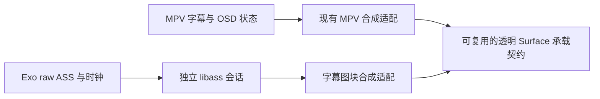
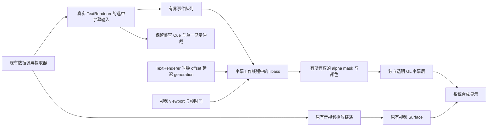

# E4-LIBASS：Exo ASS 特效字幕方案与最佳实践评审

## Recovery anchor

- 当前目标/授权（2026-09-19）：用户明确要求“修复这个bug，同样的视频mpv可以正常处理,exo没理由不能”，批准第 17 节 HDR/DV 独立 SDR 字幕层的窄修复与原片验证。
- 当前单元：`E4-LIBASS-hdr-fix-20260919`，`upstream`；分支 `feature/mpv-dv7-fel`，基线/回滚锚点 `e85dc87988bbe8e3d67509426cb5e1d1a2cee3b7`。scope 为 Exo ASS Java、对应测试/debug fixture、独立 ASS JNI 与配套产物、本文件/索引；保护初始 `app/.cxx/` 的 104 个文件。
- 已完成：确定 `ExoAssSession.admittedLocked()` 显式排除 Dolby Vision MIME、非 SDR transfer 和 BT.2020；核对当前 SSA packet 桥、独立 Surface 宿主和 native 颜色代码，完成第 17 节的窄方案取证。截图中的 Exo 为普通白字，MPV 保留大小、粗体和黄色英文；两图对白时间不同，不能当逐像素基准。
- 原片证据：vivo V2453A `10CF6H1D2L0009S` 的正常 `VideoActivity` 播放《伦敦陷落》；旧包日志确认 `media3-ssa` 输入、3840×2160 HEVC 硬解、实际输出 BT.2020/PQ（standard=6/transfer=6）、Surface dataspace `0x11c60000`。这些是安装前实测；不将它们冒充候选包的输出复测。
- 实施进度：新增 `AssVideoPolicy`，HDR/DV/BT.2020 使用原始 SDR RGB；保留 SDR 视频的旧矩阵行为及 DRM/未知 transfer/rotation/tunneling/宿主限制。JNI 在已有 colorSpace 参数为 0 时跳过历史视频 YCbCr 转换，不改 API 或依赖；代码、JNI 与测试包已构建/验证并安装。
- 验证/验收：7 项定向 Android instrumentation 均已执行，其中 6 项 HDR/颜色/JNI 修复相关用例通过（7.185 秒）；另 1 项真实 Exo 字幕生命周期用例因既有测试夹具硬编码启动包名与当前 `applicationId` 不一致而未能启动。native/APK 来源、API 24、16 KiB 和库字节核验通过。用户明确确认“可以了，打tag”，按实际观察验收闭合；取消未执行的额外截图/原片性能/相邻用例，不声称这些检查已完成。
- 时间/证据：08:29 Asia/Shanghai 开始，原目标 09:04–09:09 因解锁等待和构建环境处理延后，09:12 已告知剩余 15–20 分钟。证据在 `/private/tmp/exo-ssa-20260919/`；Gradle 联合构建 2 分 33 秒。首次沙箱缓存锁失败与后续成功日志均保留。
- 唯一下一步：按 `E4-LIBASS-hdr-fix-20260919` guard 原子提交任务文件并立即创建本地恢复 tag；无需追加测试或研究，不推送。

## 17. HDR/DV 下 SSA 样式回退诊断与修复（2026-09-19，已批准实施）

### 17.1 已证实的代码条件与推断边界

当前 `ExoAssSession.createIfEnabled()` 已在 64 位进程创建必需会话，`ExoUtil` 在追加副字幕 renderer 前给主 TextRenderer 安装 ASS observer；不是旧实验构建开关重新出现。`AssPacketInput` 保留 Media3 SSA sample 的 ReadOrder、Layer、Style、正文和覆盖标签。

`ExoAssSession.admittedLocked()` 则仍拒绝 `VIDEO_DOLBY_VISION`、PQ/HLG 等非 SDR transfer 和 `COLOR_SPACE_BT2020`。不满足条件时，`AssSurfaceHost.update()` 不创建独立字幕层，现有 SubtitleView 继续显示兼容 Cue。因此即使 SSA 内容正确，HDR/DV 片源也不会启用原字体/完整特效。该限制从原型保留至当前，是明确的能力缺口；截图片名不是实际视频元数据，仍需同片同轨验证。

仅删除上述条件不构成完整修复：`third_party/exo-ass-native/exo_ass.cpp:rgba()` 只区分 BT.601 与其余值，后者均按 BT.709 做历史 YCbCr 兼容转换。它不能正确表达 HDR 独立 SDR 字幕的颜色策略。当前 native 已使用独立 RGBA8/EGL Surface，并不把字幕烧入视频。

### 17.2 决策证据

访问日期为 2026-09-19；下列 revision 均为参考或保持，无待合并上游提交批次。

| 来源/版本 | 等级、支持的判断 | 适用性与决定影响 |
| --- | --- | --- |
| 当前 WebHTV `88aceb110959ff50afc23b10d9b9abe3e0f53255`；`ExoAssSession`、`AssSurfaceHost`、`AssPacketInput`、`exo_ass.cpp` | A：实际 admission、输入、显示和颜色处理 | 限定修复在现有 Exo ASS 链；保留主/副轨职责、时钟、字体与异常回退 |
| 锁定 libass `89cc0f4e450d64f74281a17d7f11ed05229665e8` 的 [`ass_types.h`](https://github.com/libass/libass/blob/89cc0f4e450d64f74281a17d7f11ed05229665e8/libass/ass_types.h)，本地 `build/exo-ass-native/sources/libass/libass/ass_types.h:157`，identity 与 lock 一致 | A：HDR 上的字幕应视为 SDR；精确匹配 HDR 画面颜色没有标准，呈现方选择 SDR 色彩空间；YCbCr 兼容由调用方负责 | HDR 分支采用独立 SDR 字幕颜色，不能把视频 BT.2020/PQ 直接当现有 SDR 矩阵参数；不升级 libass |
| [Android mixed SDR/HDR composition](https://source.android.com/docs/core/display/mixed-sdr-hdr)，页面更新 2026-06-17 | A：SurfaceFlinger/HWC 合成及逐层 SDR 白点/调暗；设备配置影响亮度和功耗，显示验证具有设备差异 | 保持视频 Surface 与独立字幕层；真机必须确认视频仍为 HDR/DV，字幕不过亮、透明区正常；不宣称所有旧电视一致 |
| FongMi/mpv `cca559b41ceb0bb7731cf6ef2e1f33276cd30c42`，`sub/sd_ass.c:mangle_colors` | A/B：按字幕矩阵、视频矩阵及兼容选项决定转换；basic 模式只处理 BT.601 到 BT.709 的历史转换 | 参考分离呈现与旧颜色兼容的处理；不复制 MPV 会话或替换 MPV 库，不把它的截图视为 Exo 验证 |
| [Media3 #2383 维护者讨论](https://github.com/androidx/media/issues/2383#issuecomment-2872355740)、[libass-android 作者现场报告](https://github.com/androidx/media/issues/2383#issuecomment-2880916225) | B/D：effects 内混合的亮度调整；作者报告部分设备的 effects 路径改变 HDR/DV 输出 | 确认避免为本修复改走视频 effects；报告不是当前独立 Surface 必然失败的证据。相关 API/问题讨论、成熟项目和现场证据均已覆盖 |

沿用第 10 节的 ASS 排版、字体、时间与合成资料，不重复研究已验收的渲染内核。本次不提出新的栅格化算法或性能优化，新增论文/通用博客不会改变 admission 与独立 SDR 呈现的决定；设备亮度/合成成本由实测解决，不以论文或截图替代。

### 17.3 方案与最小实施范围

| 方案 | 结果与取舍 | 决定 |
| --- | --- | --- |
| 不改动 | 保留原型边界，HDR/DV 继续失去完整字幕样式 | 不满足本问题的修复目标 |
| 只删除 HDR/DV 排除条件 | 可进入 libass，但原 BT.601/BT.709 转换会错误接收 HDR 元数据，未解决显示验收 | 不采用 |
| 原样引入第三方 effects 路径 | 需要改视频管线，扩大 DV、厂商解码/呈现和维护风险 | 不采用 |
| 适配现有独立字幕层 | 放行已支持 SurfaceView 上的非加密、非 tunneling HDR/DV；HDR 字幕作为 SDR RGB 呈现，SDR 视频保留既有矩阵行为 | 已批准实施，验证与用户验收见第 17.5 节 |

拟修改路径：`app/src/main/java/com/fongmi/android/tv/player/exo/ass/`、对应 ASS 单测/设备测试、必要的 debug fixture、`third_party/exo-ass-native/` 中 JNI 源码和配套 arm64 产物/manifest/provenance，以及本文件/评估索引。采用现有 render 参数的明确 HDR/SDR 颜色契约，避免改写用户字幕脚本。依赖版本、Media3 AAR、MPV、视频解码/输出选择、32 位支持、TextureView、DRM 与 tunneling 均不属于本单元。独立 native 构建已有 warm cache，可用 `scripts/build_exo_ass_native.py --jni-only --install` 重建必要 JNI；实施前确认精确文件 scope。

不新增字幕线程或额外逐帧中间缓冲；开启 HDR 上原本未运行的 libass 必然增加其排版/合成成本，不能称为零开销。沿用本任务普通字幕一核 CPU ≤10%、render+upload p95 ≤8 ms 的验收预算；仅当使用已获批复杂压力样本时才适用第 13 节的 40%/16.67 ms 预算。独立 Surface 的设备合成成本和视频丢帧同时记录；源码、JNI、manifest/provenance 与 App 适配整体回滚。

### 17.4 验收、时间与回滚

1. 先在原片确认视频 Format、同一主字幕轨、字体和 libass 由 COMPAT 进入 ACTIVE；同时间对照字体、字号比例、颜色、描边与位置，不能用两句不同对白做像素比较。
2. 定向覆盖 HDR10/HLG/DV admission 和原 SDR 颜色；native 固定颜色/透明度输出应证明 HDR 路径不误套旧视频矩阵，SDR 回归保持。保留原有 DRM/tunneling/宿主限制与异常回退。
3. 只构建 arm64 JNI 和手机 App/测试 APK，核对 ELF/API/16 KiB、manifest 和 APK 字节一致性；以现有核验脚本执行必要产物检查，不重建 Media3/MPV 或全 ABI 矩阵。
4. 设备原片检查视频 HDR/DV 模式、可见字幕颜色/亮度、暂停/seek、字幕开关和 Surface 重挂；同片同设置测量基线/候选的字幕耗时、CPU、视频丢帧，噪声敏感指标至少三组。字幕通过不能以改视频为 SDR、换解码器或降低画质换取。

预计批准并解锁后 25–40 分钟：局部实现和定向测试 8–12 分钟、warm JNI/Gradle 构建 3–6 分钟、设备原片与性能验证 11–18 分钟、原子提交/tag 约 3 分钟。实际开工时更新当地完成时间；原片网络/设备等待单列。最小回滚为整体撤销该次已验证实现提交，恢复本评估基线的 App/JNI 配套状态。未完成必要实机验收时不得宣称 HDR/DV 已修复。

### 17.5 实施与闭合结果

- `AssVideoPolicy` 负责 HDR10/HLG/DV/BT.2020 的独立 SDR RGB 选择；SDR 显式矩阵和缺省分辨率推断不变，未知 transfer、旋转、加密及现有宿主限制保留。`ExoAssSession` 使用该策略；`AssNative.COLOR_SPACE_SDR_RGB=0` 与 JNI 的受控分支配套。
- 独立 JNI 仅重编本地 wrapper，未升级依赖，未改 Media3/MPV 或视频输出路径。`libexo_ass.so` 仍为 2775600 字节，SHA-256 `31e04a1d26c606dd2f5df0b0b81f2916ed0b29c13b3415515a77cff540e83cc2`；manifest/provenance 与源输入一致，API 24、ARM64、16 KiB LOAD/ZIP、动态依赖和 JNI 导出核验通过。普通视频原有 YCbCr 兼容仍由测试确认。
- 一次联合 Gradle 构建通过：`:app:assembleMobileArm64_v8aDebug`、`:app:assembleMobileArm64_v8aDebugAndroidTest`，2 分 33 秒。采用既有隔离 CMake staging init script，未改初始 `.cxx`；日志 `gradle-build-approved.log`。先前沙箱禁止写 Gradle wrapper 锁文件，获准后使用现有 JDK 21/cache 完成构建，未改产品构建配置。
- 7 项定向设备测试均已执行，其中与本次修复直接相关的 6 项通过：4 项视频/颜色策略、1 项固定 ASS 绘图的原始 RGB/预乘 alpha 与 HDR↔SDR 暂停时间点重绘、1 项官方 blur/transform 帧。另 1 项真实 Exo 生命周期用例因既有测试夹具硬编码启动包名 `com.fongmi.android.tv`，而当前 `applicationId` 为 `com.silent.android.webhtv`，未能启动 Activity；该失败不由本次 HDR/JNI 改动引入，详见本轮 C4 记录。测试覆盖与原片用户验收分别记录，不以准入测试声称各 HDR 格式均做过真实视频显示测量。
- 修复 APK 已安装，SHA-256 `506daab799b6c3b42f3a8cb6e1e4c7b451658b5ca1f1739a957bb4866a2c3ff9`；测试 APK `ac81b4b41da076957e3e9db13066c6f4479121eb3a0f8fbceab4eb1804b60da2`。原安装包另存临时目录，SHA-256 `495157f6c45a515278bf5f74ad4dc9f09edd30522025887981e85e8162c05b50`；安装助手已完成 OEM 确认。
- 用户随后明确“可以了，打tag”。按显式闭合要求立即归档，不再启动原片配对性能、额外图像或其他设备/媒体验证；没有失败的必需检查。原片日志中的频繁网络缓冲不归因于本次字幕修改，也不据此宣称性能已量化。双 ABI、TextureView、DRM/tunneling 等未获批能力不扩展。
- 提交由 `Task-Guard: E4-LIBASS-hdr-fix-20260919` 定位，恢复 tag 前缀 `recovery/E4-LIBASS-hdr-fix-20260919/`，不推送。回滚整体撤销该提交中的 Java/JNI/manifest/provenance 与配套文档，恢复基线 `e85dc87988bbe8e3d67509426cb5e1d1a2cee3b7` 的配套状态。

## 上一单元 Recovery anchor：双字幕

- 当前目标/授权（2026-09-18）：用户明确要求“exo实现双字幕，对标mpv播放器”，直接实施此前评估的 MPV 默认双字幕行为：主字幕保留当前 ASS/libass 字体和特效，副字幕默认置顶、使用普通字幕样式；两路独立选择/关闭，共享一个 ExoPlayer 的媒体时钟。第 2、10 节原先不包含双字幕的边界被本次授权扩展，其他历史限制不变。
- 当前单元：`E4-LIBASS-dual-subtitles`，`upstream`；分支 `feature/mpv-dv7-fel`，基线/回滚锚点 `e2f39f240743ba4f8adf75bc6599f4ef7899d48a`。guard 保护原有 `app/.cxx/` 104 个文件；仅修改 App 的 Exo 字幕适配、既有播放器接口/管理与共用播放页/选轨页、对应测试、本文件和索引，不改 Media3/MPV/FFmpeg/独立 ASS JNI 产物或锁。
- 决定/进度：第 16 节完成源码、官方接口、维护者讨论和 MPV 实现取证。`DualSubtitleTrackSelector`、`ExoSubtitleSession`、`SecondarySubtitleCues` 和共用 UI/engine 接线已实现；主 ASS observer 只接原主渲染器，副轨绑定实际 stream 与媒体代次拒绝旧回调。13 项本机检查通过，包含真正 ExoPlayer/合并 MediaPeriod/SubtitleView 接线；最终手机 Release/Debug/测试 APK 和电视 32 位 Java 编译通过，产物见第 16.5 节。
- 验证：真实选轨/Renderer 合约检查，覆盖默认关闭、同时选中、主副独立关闭、冲突拒绝、切源/旧回调、暂停/偏移/seek；代表性手机播放覆盖主 ASS 与副文本共存和宿主重挂。手机/电视公共 Java 接线编译，单 ARM64 APK；不重跑所有 ABI/native 矩阵。
- 时间/设备：2026-09-18 08:06 Asia/Shanghai（UTC+8）开始，约 2 小时，目标 10:06；取证 10 分钟、实现 65 分钟、构建/验证 35 分钟、归档 10 分钟。08:06 ADB 无设备，已请求用户连接，同时继续实现。
- 恢复进度（11:57 Asia/Shanghai）：上一轮 10 项选轨/Cue 合约全部通过，测试体 15.437 秒，Gradle 命令总耗时 1 小时 28 分 8 秒；期间会话中断，原 10:06 目标已超时。已停止扩展研究，剩余目标约 30 分钟；ADB 仍无设备，实机同屏尚未验收。
- 归档：使用本单元 guard 一次提交源代码、测试和两份现有文档，并创建 `recovery/E4-LIBASS-dual-subtitles/` 前缀的本地注释 tag；提交以 `Task-Guard: E4-LIBASS-dual-subtitles` 定位，不推送。12:27 因打包尚未完成延后收尾，12:30 最终构建成功；没有追加研究或重复已通过的检查。
- 唯一下一步：实体手机连接后安装本轮 APK，执行现成的内嵌/外挂 ASS 双字幕实机同屏场景。当前没有设备，不将本机检查冒充实体设备的字体、Surface 或性能验收。

### 上一阶段：常规构建必需功能（已归档）

- 当前目标/授权（2026-09-15）：用户指出自行构建 debug 包又使用系统字体，并明确“这是一个必须的功能，根本不存在关闭的场景”。删除 ASS 实验构建开关，使常规手机/电视 arm64 debug/release 使用此前已验收的渲染接线；不要求额外 Gradle 参数。
- 当前单元：`E4-LIBASS-required-build`，`quick-fix`；分支 `feature/mpv-dv7-fel`，基线 `248a947ba8dcd834e386cba25e4de83984ebc1ab`。仅修改 `app/build.gradle`、`ExoUtil.java`、`ExoAssSession.java`、本文件及评估索引；初始 `app/.cxx/` 的 70 个文件继续保护。
- 原因与决定：`exoAssPrototype` 默认 false，同时控制 BuildConfig、JNI 打包、外挂标记及会话创建。历史验收包额外传 true，普通构建未启用。按第 15 节删除配置和运行时对此配置的依赖；已有能力判定、惰性 worker、失败回退保持。
- 验证状态：不传 ASS 参数的手机/电视 arm64 debug 增量构建通过（1 分 23 秒）；两包 BuildConfig 均无实验字段，编译字节码保留会话创建，DEX 含 ASS 会话，JNI 字节与仓库一致且 ZIP 16 KiB 对齐。此修复不重建 JNI，不将已有字体/性能验收冒充本轮复测。证据为 `/private/tmp/exo-ass-required-build.log` 和 `/private/tmp/exo-ass-required-artifacts.json`。
- 边界/回滚：现有独立 JNI 只有 arm64；32 位、HDR/DV 等既有能力缺口仍未实现。回滚本次原子提交即可恢复基线构建策略，取消开关不再作为当前回滚方法。
- 唯一下一步：由 `E4-LIBASS-required-build` guard finish 将已验证的 5 个任务文件原子提交并创建同名前缀的本地恢复 tag，不推送。

### 历史阶段恢复记录（以下开关策略属于旧提交）

- 目标/状态：阶段 1 外挂原型已归档；2026-09-15 实际容器 ASS 路径经修复后，用户确认“可以了，打tag”，按实际播放验收并归档。采用已有 Media3 SSA sample 的兼容桥，仍默认关闭、arm64/SDR/SurfaceView；精确 MKV duration/未缓存长事件 seek、双 ABI、HDR/DV、旧电视和产品化仍属后续阶段。
- 授权：2026-09-14 用户在复评后要求“在不破坏现有功能、性能的前提下，实施方案”，授权当前推荐的阶段 1；阶段 2–4 尚未授权。
- Lane/scope：upstream，guard `E4-LIBASS-stage1`。范围为 Exo ASS 新目录及测试、`ExoUtil`、`ExoPlayerEngine`、`PlayerManager`、公共 `PlaybackActivity`、App 构建/混淆/调试测试入口、独立 native 构建/锁/产物、TextRenderer 补丁及对应 exoplayer Maven 产物、两份现有任务文档。精确路径由 guard scope 记录。首轮证据在 `/private/tmp/webhtv-libass-research-20260914/`，复评证据在 `/private/tmp/webhtv-libass-review-20260914/`。
- 分支/实施基线：`feature/mpv-dv7-fel`；复评基线 `845ce82c64b16c94a1db7a61ed6bd38d2d1d35ac`。用户确认 MPV 修复后单独提交 `5cde3c015258f620f264d5f3ffe0a437c2ea3d48`，恢复 tag `recovery/E4-LIBASS-mpv-font/20260914222255-5cde3c015258`；当前 Exo guard 以该提交为基线，原有 Exo 改动完整接续。
- 保护：开始时仅 `app/.cxx/` 未跟踪，70 个文件由 guard 保护，不纳入本任务。
- 稳定 ID：`E4-LIBASS`；历史 `E4-2` 是 Cue layer/collision/margin 适配，不重编号、不将其冒充 libass 接入。
- 进度：输入单测 6/6、原 TextRenderer/附件/关闭路径及默认包装检查通过；暂停延迟、正常系统 provider、附件优先和完整生命周期修复已通过。最终缓存/调度版本的官方 blur/karaoke/重建与完整生命周期 4 项复测通过（7.012 秒）；用户原字体画面、实际匹配日志和原 ASS 开销已核实。三对性能、8 次释放在用户明确接受的复杂动画预算下通过，原始失败结果保留。MPV 已独立归档。
- 最便宜的决定性验证：真实 TextRenderer + fake SampleStream 的关闭、有效输入、offset/延迟、seek/流结束契约；随后进行官方固定语料、GL/生命周期/失败注入及三次配对播放测量。
- 本次时间目标：上海时间约 18:40–20:50；接线/实现 65 分钟、单 ABI/Java 构建 20 分钟、真机/性能 35 分钟、归档 10 分钟。复用已完成研究与可溯源缓存，避免重新进行广泛评审。
- 网络：系统 HTTP/HTTPS 代理为 `http://127.0.0.1:7897`；后续网络取证显式使用该代理。初次 GitHub 发现查询在代理识别前直连成功，单独记录。
- 回滚：关闭实验/恢复兼容字幕；源代码、补丁、Java 产物、JNI 与锁作为同一提交整体回退至实施基线；不推送。
- 当前变更：所有改动限 guard scope。主要符号为 `TextRenderer.Observer/Stream`、`ExoAssSession`、`AssSurfaceHost`、`AssInput`、`AssNative`；native 源在 `third_party/exo-ass-native/`。构建/运行证据集中于 `/private/tmp/webhtv-libass-stage1/`，App CMake 使用独立 `build/exo-ass-app-cxx`，初始 `.cxx` 保持保护。
- 用户追加：要求一并修复 MPV 的 ASS 原字体问题，并明确以内嵌/外挂的成熟开源处理机制为依据。MPV 文件已单独提交，退出当前 Exo guard；字体接线增加 `MediaSourceFactory.java`、`DolbyVisionP81ExtractorsFactory.java`，保留初始 70 个脏文件。事实、固定源码与修复决策见第 13 节。
- 恢复 tag：用户要求先打 tag 时尚有失败门槛，因此仅对已提交基线创建 `recovery/E4-LIBASS-font-baseline/20260914-2040`，指向 `845ce82c64b16c94a1db7a61ed6bd38d2d1d35ac`；不含本次未提交实现，不代表原型验收通过。
- 边界/风险：复杂旋转、缩放和模糊仍有实测 CPU 成本，不宣称任意脚本零开销。验收设备为 vivo V2453A/API 35，视频对照为 AVC/PCM SDR；用户原字体片段不代表原 4K 视频的解码性能。双 ABI、完整 MKV 事件、HDR/DV、旧电视仍未验收。前期多生成的 68 个 `.cxx` 文件已移至临时目录，初始 70 个文件未动。
- 最终单元：源/补丁/锁/Java 与 JNI 产物/测试/两份文档作为同一提交，由 `Task-Guard: E4-LIBASS-stage1` 及 `recovery/E4-LIBASS-stage1/` 本地注释 tag 定位，不推送。最新安装 APK SHA-256 为 `50033c50d547ebff5aba19736a572be36802b649b4c1947f55c9c65ba9a2c76e`，对应下方最终产物表。
- 当前接续：`E4-LIBASS-runtime` guard，基线 `e7c0cdf0d6dafd5679425f045192e708e92dcfed`，恢复 tag `recovery/E4-LIBASS-stage1/20260915042400-e7c0cdf0d6da`。新证据位于 `/private/tmp/webhtv-libass-live-20260915/`；生产改动尚未验证，精确范围由当前 guard 记录，70 个原始 `.cxx` 文件继续保护。
- 接续进度：`AssPacketInput`/会话/JNI/字体接线已实现；输入单测 14/14 通过（54 秒构建），独立 JNI 与 API/来源/许可证/导出检查通过，arm64 App/测试 APK 构建通过（1 分 25 秒）。JNI SHA-256 `476b3e048fff1002cbd25a328340637f0cb40fdec6a6f2f6033fc7548ac80157`。设备 6 项中 5 项通过；容器生命周期的首轮失败已确认是旧绘图素材的兼容 Cue 基线为空，素材已修正并重新打包。用户随后确认实际播放正常并要求 tag，按显式验收立即收尾，不补跑该项或追加截图；不将未复测项目写成通过。
- 唯一下一步：执行 `E4-LIBASS-runtime` guard finish，将本次源/测试/产物/记录作为一个原子提交并立即创建本地恢复 tag，不推送。

### 阶段 1 验证口径（运行前冻结；复杂动画预算经用户明确修订）

- 同一 vivo V2453A/API 35、同一 AVC/立体声 PCM SDR 样片、同一播放器设置，交错测量关闭/开启共三对；每次完整播放，记录启动、seek、掉帧、underrun、CPU/PSS、render/upload/swap 和温度。样片改 PCM 的现有 AAC 输出环境原因见第 13 节，生产音频策略未改。启动和 seek 的三次中位数增量分别不超过 `max(50 ms, 基线 10%)`、`max(30 ms, 基线 10%)`；不得新增 underrun，不得三对中两对出现额外视频掉帧。
- 常规/用户 OP 样本：libass render + GL upload 的 p95 总和不超过 8 ms，worker CPU 不超过一核的 10%。2026-09-15 用户明确选择“保留完整特效，接受复杂字幕的实测 CPU 开销”，接受将连续旋转/缩放/blur 的 `animated.ass` 压力样本单列为一核 CPU ≤40%、render + upload p95 总和 ≤16.67 ms；此前已向用户说明这两个具体上限。swap 单列，不以等待时间冒充 CPU 工作。整进程 PSS 增量 ≤64 MiB，预热后末次与首次释放态增量 ≤8 MiB。原始 10%/8 ms 的压力样本失败记录保留，不改写为原门槛通过。
- 固定官方字体/viewport/时间的 blur+kf PNG 采用预先选定容差：前景并集 RGBA 平均绝对误差 ≤1.5，任一通道误差 >16 的前景像素比例 ≤2%。屏幕可见、暂停延迟、Surface 重建、关轨、失败回退和最终资源释放独立验收。
- 字符集限制：无 BOM 的短 GB18030 文本可能被现有 `UniversalDetector` 误判；20:13 对旧失败样本的独立探针得到 KOI8-R，对完整代表性样本得到 GB18030。原型保持既有检测策略，不宣称可可靠推断任意短文本编码；BOM/UTF-8 和完整代表性 legacy ASS 分别测试。

## 研究问题与证据标准

1. 是否已有可复用、维护中的 Media3/libass 扩展，而非仅编译脚本或演示？
2. 如何保留 ASS 原始事件、头部、字体附件和时间轴，避免普通 Cue 转换丢失动画/卡拉 OK 信息？
3. 时钟、seek/flush、选轨、暂停/倍速、字体、渲染线程和 Surface 生命周期应如何分工？
4. CPU 位图叠加、GPU 合成、WASM/WebView 或视频烧录各有什么实际限制？
5. 当前 WebHTV 的本地 Media3 补丁、网络/预加载、HDR/DV、双 ABI 与现有字幕行为如何保留？

证据分类：A=源码/测试/官方契约；B=维护者解释或成熟项目实践；C=有方法的独立技术报告；D=单篇帖子或未经复现的经验。论文与宣传性性能数据不会直接转化为本项目性能保证。

## 1. 结论与建议

当前构建策略以第 15 节为准：用户已明确 ASS 是必需功能，删除实验构建开关。下述阶段 1 的默认关闭建议保留为历史设计记录。

**可以自行实现，推荐复用成熟的 libass 排版/特效内核，自行完成 Exo 接入和呈现适配。** 不必等待 Media3 官方合并 libass，也不必重新发明 ASS 解释器。

目标是让 Exo 播放时支持字幕组常见的定位、移动、变换、卡拉 OK、描边/阴影/模糊、矢量绘图、裁剪、分层及嵌入字体。这里的“完整特效”以选定 libass 版本及测试语料为基准，不能扩大为全部 VSFilter 历史行为、所有字体格式或所有电视均完全一致。

最直接的开源起点是 **peerless2012/libass-android**；最有价值的实际消费者是 **Jellyfin Android TV**；跨平台设计参照是 **GStreamer、VLC、Kodi、JASSUB**。这组证据能支撑可行性和设计选择，不能代替 WebHTV 的性能及 HDR/DV 实机验收。

建议批准时只先实施阶段 1：默认关闭的外挂 ASS 原型，验证 libass、字体、复用既有承载方式的透明层、准确时钟及兼容字幕回退。复评将接入方式收敛为“保留真实 TextRenderer + 本地窄观察接口”，见 6.1；代价是首阶段需要重建受影响的 Media3 Java 产物，而不只是加 App 类。对于视频为 SurfaceView 的路线，优先复用现有字幕 SurfaceView 的承载契约。其余阶段逐阶段批准，不自动进入 MKV 提取器或生产默认行为修改。

### 1.1 复评发现及决策变化

原方案的 libass 内核、独立叠加层和分阶段方向成立，但以下缺口必须补齐，才能据此实施。

| 优先级 | 已核实的缺口 | 本次决定 |
| --- | --- | --- |
| P1，编码前 | 实际 Media3 默认不在提取阶段解析外挂字幕；只注入 parser factory 可能完全不走预期路径 | 从当前选中的 TextRenderer 输入接入；不全局翻转字幕解析模式，见 2.2、6.1 |
| P1，编码前 | raw ASS 带合成 Dialogue 前缀；原始 BlockDuration 已被写成百分之一秒，不能冒充原始 MKV chunk | 外挂完整文件、Media3 封装事件、原生 MKV 事件三种输入显式区分；精确 MKV 输入留给阶段 2 |
| P1，编码前 | NoSampleRenderer 不接收文本延迟消息；包装 TextRenderer 会绕开 RendererHolder 的类型特判 | 保留 TextRenderer 实例及其原状态机，在实际 offset/延迟已知的位置输出观察数据 |
| P1，原型验收 | 无操作 parser、隐藏 Cue 和“异常时回退”之间缺少可执行的恢复路径 | 保留兼容 Cue、保存当前有效输出，成功接管才抑制重复显示；输入超限或原生层可返回失败时恢复，见 6.4 |
| P1，MKV 验收 | “seek 后重放长事件”不是缓存自然能保证的能力，尤其首次跳到未读区间 | 明确已缓存/未缓存两类；缺少覆盖证明时不声称完整支持，见 6.2 |
| P2，产品化前 | 色彩矩阵、晚到字体、API 24 与现有 CMake API 26 差异、实际图像基准还不够具体 | 补 libass 官方契约和回归语料；基础 native 门槛前移至首次构建，见 6.3、9、11 |

这些是对方案和接口的审查结论，不是已复现的 WebHTV 故障，也不是对开源项目整体质量的评价。

## 2. 当前 WebHTV 的实际基础

| 已有能力与落点 | 对本次设计的约束 |
| --- | --- |
| [ExoUtil.java](../app/src/main/java/com/fongmi/android/tv/player/exo/ExoUtil.java) `setPlayerView`：启用 embedded styles，但关闭 embedded font sizes；已有用户字幕位置/字号设置 | 普通字幕继续沿用原行为；ASS 原样模式必须明确用户字号/位置覆盖规则，不能无条件破坏脚本坐标 |
| 同文件 `buildPlayer`、`buildRenderersFactory`：自定义 `FfmpegRenderersFactory`、软解/硬解选择、音频输出和动态调度 | 只能装饰既有工厂；不能换成扩展示例中的默认播放器工厂 |
| 同文件约 212 行已注册 `PlaybackAnalyticsListener` 为 `VideoFrameMetadataListener`；[PlaybackAnalyticsListener.java](../app/src/main/java/com/fongmi/android/tv/player/exo/PlaybackAnalyticsListener.java) `onVideoFrameAboutToBeRendered` 更新帧率、帧调度/seek 诊断 | 如使用帧时间做字幕同步，应共享分发并保留原监听者；再次直接 `setVideoFrameMetadataListener` 会覆盖既有接线 |
| [MediaSourceFactory.java](../app/src/main/java/com/fongmi/android/tv/player/exo/MediaSourceFactory.java) `createUpstreamDataSourceFactory`、`getExtractorsFactory`、`createMediaSource` | 保留 OkHttp 请求头、EOF 恢复、预加载优先级、缓存、APE、拼接播放及仅加载选中轨道策略；外挂字幕也走现有数据源契约 |
| [DolbyVisionP81ExtractorsFactory.java](../app/src/main/java/com/fongmi/android/tv/player/exo/DolbyVisionP81ExtractorsFactory.java) `wrap`：Matroska raw subtitle、远程 deferred Cues、DV7/P8.1 参数和视频包装 | 直接替换为第三方 `AssMatroskaExtractor` 可能丢失这些参数和后续视频适配；应在现有链路加最小输入钩子 |
| 锁定的 Media3 `SsaParser` 及 `SsaParserTest` 已有样式、位置、layer、重叠与字体样式测试；历史 E4-2 为 layer/collision/margin 适配 | 当前不是“完全不支持 ASS 样式”；缺口是完整运行时特效、字体与帧呈现。不能把 E4-2 重新包装成新任务 |
| MPV 的独立 native 链已经带 libass 与字体库 | 可用作视觉参考；不能从 `libmpv.so` 内部借私有符号/JNI 给 Exo，不能把 MPV 播放成功当作 Exo 验证 |

本地版本依据：[media-lock.json](../third_party/media-lock.json) 的 Media3 `1.11.0-alpha01-fongmi`，源码提交 `e3e922d5c01bc0b564849940fe589daf37360d15`；nextlib `1.10.0-0.12.1-fongmi-softload-av3a-ffmpeg901-r3`，提交 `6ff6cf9d0820382b3c233d018c52e4163b09d345`。**Media3 实际产物还叠加 lock 中的补丁和 artifact overrides，不能仅凭裸提交判断发布行为。** 首轮读 Git 对象；复评进一步读取本地 Maven sources JAR，核得 exoplayer SHA-256 `83f4f83b4f44e621d52002c161f63fbcb77be6856af4b1e4a4cb0982b04549e1`、extractor SHA-256 `ec22c28c9fef1f4fdb54b495da919a706d4a28b781ac6701790a259beee6dedd`，均与 lock 一致。此处是源码身份核验，没有重新编译或验证二进制运行行为。

`/Users/macbookpro/Desktop/github/media` 的当前 checkout 是 `3c2cbe8ac742c2fe15eff52f03eeb3b1b648848d`，不能与锁定产物混为一谈。锁定源码也确认存在 `NoSampleRenderer.onRendererOffsetChanged(offsetUs)` 和 `onPositionReset(...)`；前者契约明确规定从 renderer position 减去 offset 得到媒体位置。实现时仍需对实际依赖进行编译验证。

### 2.1 用户补充：已有 MPV 字幕 SurfaceView 能否给 Exo 复用

**可以复用显示承载和部分合成实现；目前它还不是一个任意播放器可直接调用的完整 ASS 服务。** 初稿只提独立层，没有充分纳入本地已实现的这部分，现修正推荐优先级。

核验到的真实链路：

1. [MpvPlayer.java](../app/src/main/java/androidx/media3/mpvplayer/MpvPlayer.java) 约 2827 行 `createOsdSurfaceView()` 创建普通 `SurfaceView`，设置 `setZOrderMediaOverlay(true)`、`PixelFormat.TRANSLUCENT`、不接收焦点/点击，并放到视频 SurfaceView 的同一父容器。它依赖 `requiresOsdSurface()` 的 direct-output/ISO 条件，并非所有 MPV 输出都走此层。
2. `osdSurfaceCallback`、`reconcileOsdSurface()` 管理尺寸与挂接；[MPVLib.java](../app/src/main/java/is/xyz/mpv/MPVLib.java) 的 `enqueueOsdSurface` 经 [render.cpp](../third_party/mpv-player-jni/src/render.cpp) 和 [request.cpp](../third_party/mpv-player-jni/src/request.cpp) 设置 MPV 的 `android-osd-wid`。JNI 明确要求 MPV 已初始化，没有“提交 ASS_Image 给任意 Surface”的接口。
3. 固定 MPV 源码 `video/out/vo_mediacodec_embed.c` 在 `draw_frame` 用视频 PTS 调 `android_osd_overlay_render`，在 `flip_page` 呈现 OSD；本地另有 optional-OSD/timed-release 补丁，不能把裸源码的前置条件当成当前成品所有行为。
4. `video/out/android_osd_overlay.c` 已实现 `ANativeWindow`、RGBA EGL window surface、GLES2 shader、预乘 alpha 混合、纹理上传、change-id 缓存、清屏与释放。其 `android_osd_overlay_render()` 调用的是 `osd_render(ctx->vo->osd, ...)`，只请求 `SUBBITMAP_BGRA`，然后上传 MPV 打包后的彩色字幕图块。

| 现有部分 | 复用判断 | 必须保留/补上的边界 |
| --- | --- | --- |
| 透明 SurfaceView 创建、层级、尺寸、非交互属性 | 可提取最小通用承载逻辑，Exo/MPV 分别使用 | 生命周期回调应交给当前生产者；避免为 Exo 创建两个重叠字幕层 |
| EGL/GLES 合成、clear、缓存和行拷贝思路 | 有真实复用价值，可评估抽取后重新编译 | 目前依赖 MPV 的 vo/OSD/日志/分配器；拆依赖和许可成本应与采用 libass-android 合成器比较 |
| 字幕图像接口 | 需要适配 | MPV 合成器消费 packed BGRA；libass 输出 mask+color。可先转换有界图块验证正确性，再决定是否保留 BGRA 或改 mask shader；不能把每帧整屏 RGBA 转换当默认 |
| MPV 选轨、字体、ASS 状态与时钟 | 不能直接挂给 Exo 使用 | 属于 MPV 的 demux/OSD 实例；Exo 自己提供 raw events、字体、选轨和媒体时钟 |
| `MpvOsdSurfacePolicy` 与 native 挂接队列 | 借鉴已有回归用例，按内核保留策略 | “当前片首次用过就保留”“先拆 video 再拆 OSD”解决 MPV 特定问题，不宜全量搬进通用宿主 |

`MpvOsdSurfacePolicyTest` 已有选轨、隐藏、首用后保留及 Surface 销毁顺序测试，本轮只读取，未重跑。Surface 归属切换必须先让旧生产者停止并解除连接，再交新生产者；不能让 MPV 和 Exo 的 EGL 同时连接同一个 Surface。复用代码/宿主并不要求跨播放器切换时永远保留同一个 Surface 对象。

推荐的概念分工：

图中两条路径按当前播放器择一连接。最小原型先复用 SurfaceView 的承载契约和必要代码；Exo 使用自己的 GL 生产者，首阶段不修改 MPV Java/JNI/native、不共享 EGL context、不抽取公共合成模块。优先参考 libass-android 的 mask 合成；MPV packed BGRA 合成器作为对照。后续只有维护或性能证据支持时，才另行决定公共代码抽取。

成熟方案与本地方案的对应：Jellyfin/libass-android 是“Exo 提取输入 + 独立 libass + 独立 EGL/GLES + 透明 TextureView”；现有 MPV direct-output 是“MPV 的字幕/OSD + 独立 EGL/GLES + 透明 SurfaceView”。共同点是字幕单独产生图像并合成，SurfaceView 与 TextureView 只是输出承载的不同选择。

AOSP 文档确认 SurfaceView 可直接作为 EGL/GLES 输出，单独交给 SurfaceFlinger 合成；TextureView 内容先进入应用 UI 合成，更方便 View 变换。额外图层是否使用硬件 overlay 取决于设备，不能保证新增 SurfaceView 总是更快。现有代码仅处理底层视频为 SurfaceView：若 Exo 选择 TextureView，必须另验 Z-order/UI 遮挡，必要时选透明 TextureView 字幕宿主；也不能承诺两个独立 Surface 严格原子同帧呈现。

### 2.2 复评补核：实际发布代码决定接入位置

以下 Media3 文件指 2 节核对 SHA-256 的 sources JAR 内相应类，不是外部 checkout 的 HEAD。

| 实际调用链/符号 | 核实结果与实施约束 |
| --- | --- |
| `ExoUtil.getMediaItem/buildSubtitleConfigs` → `DefaultMediaSourceFactory.createMediaSource` | 默认 `parseSubtitlesDuringExtraction=false`，外挂走 `SingleSampleMediaSource`，合并成文本轨道后由 TextRenderer 解码。不能只调用 `setSubtitleParserFactory` 就认为完成接线，也不应为 ASS 全局改变其他格式的解析时机 |
| `DefaultRenderersFactory.buildTextRenderers` → `new TextRenderer(output, looper)` | TextRenderer 是 `final`；具有接收 `SubtitleDecoderFactory` 的公开构造函数，且本地 `legacyDecodingEnabled=true`。这是最小解码扩展点，但它单独不提供完整呈现时钟/period 生命周期 |
| `RendererHolder.setCurrentStreamFinalInternal` / `hasReachedServerSideInsertedAdsTransition` | 对真实 `TextRenderer` 做 `instanceof` 判断，处理 final stream end 和流切换。通用 Renderer 包装器会改变这些语义；“委托了所有接口”仍不等于无回归 |
| `ExoPlayerImplInternal` → `RendererHolder.setTextOffsetMs` → `TextRenderer.handleMessage` | 延迟消息只发给 `TRACK_TYPE_TEXT`；`NoSampleRenderer` 的类型是 NONE。正值延后，渲染查询时间为 `positionUs - textOffsetUs`；不能从 UI 线程轮询或漏接该设置 |
| `MatroskaExtractor.writeSubtitleSampleData/commitSampleToOutput` | `FLAG_EMIT_RAW_SUBTITLE_DATA` 只表示未转成 Cue，仍输出 `Dialogue: 0:00:00:00,<duration>,<原始 chunk>`；初始化数据为 `[合成 Format 行, CodecPrivate]`，duration 被量化至 10 ms。原始 ReadOrder 还在，但需要识别封装；直接喂整包 libass 或将 initData[0] 当 CodecPrivate 都不对 |
| 同一 MatroskaExtractor 的 ContentEncoding 分支 | 本地已接受文本 zlib，处理解压并在提交时裁切 NUL；还保留 header stripping 相关路径。第三方 #85 的再次探测解压不能直接移植；阶段 2 钩子应取得明确编码处理后的有效字节和原始 duration，对不支持的组合明示失败 |
| [PlaybackActivity.java](../app/src/main/java/com/fongmi/android/tv/ui/activity/PlaybackActivity.java) `attachSurface/detachSurface/resetVideoSurfaceForDecoderSwitch/syncVideoSurfaceSize` | 公共 Activity 负责手机/电视宿主挂接；`setRender` 会更换底层 View，Surface buffer 尺寸也可能与 View 布局不同。这里接 host 生命周期，不能只在 `ExoUtil.setPlayerView` 一次性创建层 |
| [ExoPlayerEngine.java](../app/src/main/java/com/fongmi/android/tv/player/engine/ExoPlayerEngine.java) `rebuild/release` | 播放器重建和 Activity 配置变化不是同一生命周期。会话属于 engine/player，Surface 属于当前 Activity；detach 只释放显示资源，engine release 才关闭会话；rebuild 必须失效旧回调 |
| [PlayerManager.java](../app/src/main/java/com/fongmi/android/tv/player/PlayerManager.java) `setTextOffsetMs`，`PlayerEngine.supportsSecondarySubtitle` | 复用当前延迟设置。原 ASS 阶段不包含 Exo 双字幕；2026-09-18 用户另行授权后，按第 16 节增加两路字幕，保留原有选轨及 MPV 能力 |

选轨身份必须包含 player/session、`MediaPeriodId`、轨道标识及 stream generation；不能只用 `Format.id`，也不能仿照候选实现截取冒号后的 ID 来做全局匹配。拼接播放、外挂合并源、后台预加载和旧 decoder 回调都可能重用局部 ID。网络读取仍使用当前播放支路的 DataSource/OkHttp/headers/cache；不另开 native HTTP，也不把预加载优先级的 helper 当作前台字幕数据源。

## 3. 核验过的开源实现与成熟度

### 3.1 首选参考：libass-android 与 Jellyfin Android TV

`peerless2012/libass-android` 不只是 NDK 编译脚本：包含 `ass`、`ass-kt`、`ass-media`，覆盖 JNI、外挂解析、Matroska 字幕/字体、选轨、渲染工厂、Canvas/GL 输出。包装代码是 MIT；其 native CMake 静态链接 libass、FreeType、HarfBuzz、FriBidi、fontconfig、expat、libunibreak 等，依赖许可证需分别处理。

在固定版本 Jellyfin Android TV 中，`ExoPlayerBackend.kt` 实际创建 `AssHandler(AssRenderType.OVERLAY_OPEN_GL)`，在 `enableLibass` 开关下包装 extractor/renderers factory，并把 `AssSubtitleView` 加入字幕视图。版本目录引用 `io.github.peerless2012:ass-media:0.5.1`。这验证了有真实项目接入；未据此推断全部发布版本均默认开启或所有设备均稳定。

扩展提供的模式必须区分：

| 模式 | 实际用途 | WebHTV 决策 |
| --- | --- | --- |
| `CUES` | 向传统 Cue/SubtitleView 输出；项目表格明确不支持动画，也是便捷构建入口的默认值 | 不能用它宣称完成 ASS 特效接入 |
| `EFFECTS_CANVAS` / `EFFECTS_OPEN_GL` | 在 Media3 视频 effects 流程合成，可随视频帧处理 | 会介入视频处理，HDR/DV 及缓冲/时序成本另行验证；本次不优先 |
| `OVERLAY_CANVAS` | 独立视图，可显示动画 | 当前部分工作会阻塞 UI；仅可作为有预算的兼容回退参考 |
| `OVERLAY_OPEN_GL` | 独立渲染线程和透明 TextureView，GPU 合成 mask | 参考其分层方式；本地优先评估复用字幕 SurfaceView，具体见 2.1；不等于 GPU 完成全部 ASS 排版/模糊运算 |

必须改造或核验的具体问题：

1. `render/AssRenderer.kt` 写死 `positionUs - 1000000000000L`。应读取实际 renderer offset，并处理拼接媒体、非零起播和 discontinuity；不能靠调一个固定字幕延迟掩盖。
2. `kt/AssPlayer.kt` 的便捷构建会设置新的 MediaSourceFactory；`withAssMkvSupport()` 会替换 MatroskaExtractor。不能直接覆盖 WebHTV 自定义工厂。
3. `extractor/AssMatroskaExtractor.kt` 反射读取 `extractorOutput`、`subtitleSample`，并按附件长度分配字节数组。对 Media3 版本、混淆和异常附件均敏感；长期适配优先明确的受控源码扩展点。
4. `executor/AssExecutor.kt` 存在 8 ms future 等待路径；异步任务对象和 busy/lastFrame 状态跨线程使用。需要改为清晰的所有权、有界排队和过期结果丢弃。这是源码风险判断，本轮没有复现竞态。
5. 源码默认 glyph cache 为 10000、bitmap cache 为 128 MB、`maxRenderPixels=0`。这不是低内存电视的已验证预算。
6. 已读取的 `lib_ass_media` 单测仍是 `assertEquals(4, 2 + 2)` 模板；不能用“仓库有 tests 目录”证明时钟、生命周期或画质回归覆盖。
7. 维护者/用户记录了 Mali-470 缺少 `GL_EXT_unpack_subimage`、alpha 混合、Android 7 JNI local-reference 溢出、快速移除视图和暂停 resize 问题。部分补丁已合并，但必须核对选定版本；不能把 closed 一律当 merged。
8. #71 的约半秒特效字幕延迟仍为 open 用户报告；#85 压缩 ASS 载荷修复为 closed 但 API 返回 `merged_at=null`。这些是必须纳入语料的风险，不据此声称所有场景都会失败或已修复。

### 3.2 第二参考：LumeraD3v/assrender

有更短的 Media3→libass→Bitmap overlay 实现，包装代码 Apache-2.0，适合理解最小接线。但不建议整包引入：

- 提取器也使用反射；`AssHandler` 使用主线程 Handler、`player.currentPosition` 和约 30 fps 循环，无法直接满足逐帧贴合或重负载要求。
- 实际 `CMakeLists.txt` 编译了 `subtitle_pipeline.c` 与 direct 路径，并链接 avformat/avcodec/avutil/swresample 等 FFmpeg 库。README 的“direct 路径不需要 FFmpeg”不等于当前包没有这些依赖。
- open issue #3 报告旧 Media3 1.5.1 AAR 在 1.9.0 出现 `AbstractMethodError`；open PR #1/#2 涉及默认字体、日志和缺失选轨接线。这些报告不能自动当成主线已修复。
- README 声称 Exo 会移除所有样式，与本地 SsaParser 已有功能不符，未采信该概括。

### 3.3 跨平台参考真正能借什么

| 项目 | 已读的实际实现 | 可借鉴内容与边界 |
| --- | --- | --- |
| GStreamer `assrender` | `gstassrender.c`：视频和字幕 segment 都转为 running time，再喂事件、渲染、合成 | 跨时间域归一化、队列/锁、seek 后 segment 变化；不能照抄其管线 API 到 Exo |
| VLC | `modules/codec/libass.c`：`ass_add_font`、按 PTS/duration 喂 chunk、按呈现时间调用 libass、检查 change 标志 | 字体附件、时间单位、只在必要时重建区域；复制代码前须审核该文件许可证 |
| Kodi | `DVDSubtitlesLibass.cpp`：字体、事件、锁、flush，以及 seek 后重叠事件排序注释 | 把逆向 seek、ReadOrder 和重叠字幕做成真实回归用例；注释不是所有现版本都会错的证明 |
| JASSUB | `JASSUB.cpp`、`worker.ts`、`webgl2-renderer.ts`：libass WASM 在 worker 渲染 mask，GPU 合成 | 分离布局/栅格化与合成、worker 所有权、空帧清屏、预乘 alpha、字体加载；现代 WebGL2/OffscreenCanvas 等要求不适合默认塞入老电视 WebView |
| FFmpeg subtitles filter | `vf_subtitles.c`：按视频帧 PTS 调用 libass，并把 mask 混入 AVFrame | 可用作离线参考画面；烧录必须介入视频帧处理，播放未必需要重新编码，但硬件帧下载/上传与处理成本不能忽略 |

JASSUB 的 `rawRender` 区分“无需更新”的 null 与“需要清空”的空数组，其 worker 执行 GPU 绘制；WebHTV 也必须区分无变化、空画面和失败。只缓存最后一帧会让字幕在结束/关轨后残留。

## 4. 官方提案、文档与论文如何影响决策

Media3 [PR #2324](https://github.com/androidx/media/pull/2324) 是已有 libass 提案，但作者注明不再继续，维护者表示维护成本高、预计不会合并。提案列出仅 MKV、缺外挂、注入点临时、逐帧问题和 4K `draw_ass_rgba` 太慢等缺口。它是很有用的失败边界说明，不是可直接依赖的官方扩展。

[Media3 #2042](https://github.com/androidx/media/issues/2042#issuecomment-2595058592) 的维护者解释：解析发生在提取阶段，此时无法知道稍后的最终视频显示尺寸；需要更晚的自定义字幕显示组件。[#2289](https://github.com/androidx/media/issues/2289#issuecomment-2766645727) 则解释默认文本回调有播放器循环、线程切换和 UI 重绘延迟，并非逐帧呈现系统。后续维护者建议可实验使用 VideoFrameMetadataListener，但未承诺更改普通字幕时间戳语义。因此，单换 SubtitleParser 无法完整解决问题。

Matroska 的 ASS 规范规定：header/styles 在 CodecPrivate；事件 Block 保存 `ReadOrder,Layer,Style,Name,MarginL,MarginR,MarginV,Effect,Text`，时间与持续时长来自容器。外挂完整 ASS 与 MKV chunk 必须采用不同的输入方法，不能从已经扁平化的 Cue 反向恢复。

阅读的图形学论文是 Chris Green（Valve，2007）《Improved Alpha-Tested Magnification for Vector Textures and Special Effects》：SDF 可改善文字/矢量纹理缩放和边缘效果，但不负责 ASS 事件语义、复杂脚本 shaping、字体匹配或播放器同步；文中也讨论单通道距离场的转角问题。**它支持未来局部 GPU 优化的研究方向，不支持本轮重写 SDF ASS 引擎，也不是 Android 性能数据。** 本轮没有获得能直接证明某个 ASS Android 接入方案最优的对照论文，不把不相关论文数量当结论强度。

技术博文 [Text Rendering Hates You](https://faultlore.com/blah/text-hates-you/) 对样式、换行、shaping、字体 fallback、亚像素/透明度及大字形缓存的耦合有具体解释。它进一步支持复用 libass + FreeType/HarfBuzz/FriBidi，而不是在 Java/Canvas 中逐个补标签。博文是工程解释，不是本项目 benchmark。

## 5. 方案比较与明确取舍

| 方案 | 正确性/质量 | 性能与兼容性 | 维护成本 | 决定 |
| --- | --- | --- | --- | --- |
| 不改，沿用 SsaParser/Cue | 保留现有普通字幕；完整动画等缺口仍在 | 无新增 native/GL 成本 | 最低 | 保留为默认及回退基线，不能满足本需求 |
| 原样采用 libass-android 便捷 builder | 内核成熟，但本地工厂、时钟与布局可能错配 | Media3 1.8.0 参考源码与本地 1.11.0 fork 不同；旧 GPU、预算需验证 | 初次接入低，后续隐性成本高 | 拒绝原样套用 |
| **libass + TextRenderer 窄观察接口 + 独立字幕层** | 保留真实 TextRenderer 与兼容 Cue，从选中轨道取得输入/offset/延迟；libass 解释原始内容 | 复用 SurfaceView 承载方式，独立 native/GL；双路解析的额外成本须测 | 中等，需维护一个受控 Media3 补丁和对应 Java 产物，不重构 MPV | **推荐，分阶段原型** |
| 仅 App 的自定义 SubtitleDecoderFactory + NoSampleRenderer | 可截获选中 ASS，避免提取器反射 | 仍须额外解决 period 绑定、延迟消息、动态调度和回退；无样本 renderer 本身不能消费字幕 | 少一次 Media3 产物修改，但生命周期桥接更多 | 作为对照方案；不把固定 offset 或 UI currentPosition 轮询作为最终设计 |
| 视频 effects 内合成 | 更容易围绕视频帧生成字幕画面 | 介入 video pipeline；HDR/DV、tunneling、附加处理和延迟需单独验证 | 中高 | 独立层达不到明确时序目标时再评估 |
| WebView + JASSUB/WASM | 复用 libass，可参考已有浏览器产品 | WebView/worker/WebGL 版本、JS/JNI 时钟、内存与故障面增加 | 中高 | 借鉴设计，不作为 Android TV 首选 |
| FFmpeg filter 烧录 | 成熟 libass 输出，可生成参考片段 | 改变视频帧处理和硬件路径；可能引入下载/上传，不能宣称零成本 | 高 | 离线对照；不作默认播放架构 |
| 自研 Java/Canvas 或 GPU/SDF ASS 引擎 | 标签组合、shaping、历史兼容需重新验证 | 单项 GPU 优点不等于整体更快 | 最高 | 首轮拒绝 |

不需要让 Exo 通过 MPV 播放视频，也不需要把 libplacebo 作为 ASS 语义引擎；它们可提供合成设计或参照画面，但无法替代原始事件、字体与时钟接入。

## 6. 推荐数据流与关键契约

### 6.1 接入方案：保留 TextRenderer，增加可选观察接口

**这是待实施的 WebHTV 适配设计，并非 Media3 已存在的 API。** 在本地 `TextRenderer` 增加默认 null/no-op 的观察接口，由 `ExoUtil.buildRenderersFactory` 的既有 Ffmpeg 工厂接线；保持真实类型、解码器、Cue 解析、选轨、final stream、原有构造函数及非 ASS 行为。观察接口只接收以下数据，不允许回调阻塞播放器线程：

| 观察数据 | 触发位置及约束 |
| --- | --- |
| stream/format/reset/end | `onStreamChanged`、`onPositionReset`、disabled/release 与最终流边界；带真实 `MediaPeriodId`、stream offset 和 generation。读取中的下一个 period 与正在显示的 period 分开记录 |
| 选中 ASS 样本 | 成功的实际 sample read，跳过 peek/omit-data、EOS 和不支持的加密输入；有界复制有效 offset/length，保留时间、格式、初始化数据及输入类型。不得在样本已经转成 Cue 后还声称得到原始 ASS |
| clock/config | 在 TextRenderer 已知实际 stream offset、字幕延迟和播放状态的位置生成快照；包括暂停/缓冲、倍速、文本延迟变化。回调只发布轻量数据，不执行 native parse/render/GL |
| 兼容 Cue | 保留原输出，记录当前 generation 的最新 CueGroup；由一个显示仲裁点决定当前显示兼容 Cue 或 ASS 层，具体见 6.4 |

可在公开 `SubtitleDecoderFactory` 扩展点做 decoder 侧复制，以减轻播放线程工作，但必须使用上述同一 stream 身份和时钟契约，保留委托 decoder 的 flush/release、charset 与队列规则。是否需要 decoder 钩子由一次最小实现决定，不并行维护两套输入路径。禁止使用全局 AssHandler 收集所有 extractor 的事件；预加载和未选中轨道不应创建 libass 会话。

观察接口补丁只作用于受影响的 `media3-exoplayer` Java 产物及必要接线；不改变音视频 renderer、LoadControl 或默认字幕解析开关。测试必须覆盖观察接口关闭时的既有行为，以及 stream 切换/flush/最终结束。编译成功不能代替这些契约测试。

### 6.2 输入、时间与 seek

- 外挂完整 ASS：经现有授权数据源读取有界字节，确定编码后交给 `ass_read_memory`/对应完整文件接口。无需把本地 URI 当任意文件路径开放给 native。
- 外挂保留 BOM/UTF-8/UTF-16/GB18030 等当前字节安全补丁已有行为；编码转换只做一次，先在有效长度内规范化到 UTF-8，再处理字符串边界，不能在 UTF-16 原始字节上遇零截断。新增 libass 副本/解析有大小限制，不把这个限制误说成已经解决旧 SingleSample loader 自身的峰值内存问题。
- MKV：原始 CodecPrivate 走 `ass_process_codec_private`，每个解压后的完整事件走 `ass_process_chunk`，使用真实 PTS/duration（微秒到毫秒明确转换）。保持 ReadOrder、Layer、Style、覆盖标签及逗号正文；不能同时混用手动 event 修改破坏 libass 的 chunk 去重契约。
- 适配类型明确区分 `FULL_SCRIPT`、`MEDIA3_SSA_SAMPLE` 和 `MATROSKA_ASS_CHUNK`。阶段 1 只接管 FULL_SCRIPT；阶段 2 在当前 Matroska 源码增加默认关闭的明确输出契约，携带真实 `blockDurationUs`、CodecPrivate 和附件归属，经过 SampleQueue/选轨或等价受控通道再进入会话。若仅剥离现有 SSA_PREFIX，只能得到量化后的 duration，必须标为兼容桥，不能通过“精确 MKV 事件”验收。
- 原始数据钩子应在 Cue 扁平化之前，且在容器 ContentEncodings 正确处理之后。NUL、zlib、buffer offset/limit 都有实际缺陷报告；不把 backing array capacity 当有效样本长度，不靠探测两个 zlib 字节替代完整容器语义。
- 字体附件可能早于或晚于轨道/样式到达。按会话登记、内容哈希去重，字体集变化后触发正确的 font lookup/cache 更新；限制数量、单体/总字节，区分缺字、缺字体和未选中轨道。
- 不把“字体文件名”当唯一字体 family 身份，不假定系统一定有某个字体路径；配置可验证的 fallback，覆盖 CJK、阿拉伯/RTL、组合字符。默认不联网下载字体；新增本地/在线字体来源需单独定义授权、缓存和隐私行为。

- 推荐观察接口直接采用 TextRenderer 当前 offset：`t_ass_ms = floor((rendererPositionUs - streamOffsetUs - textOffsetUs) / 1000)`；`textOffsetUs > 0` 表示晚显示。同样本绑定的时间已被 `BaseRenderer.readSource` 加过 stream offset，归一化时只减一次；原始提取器的 period 时间不能再减一次。未知时间、溢出和已失效 period 不参与计算。若使用 NoSampleRenderer 对照实现，须显式补齐延迟传递；不能假设它会收到文本消息。
- onPositionReset、媒体切换、选轨、关轨、release 都推进 generation；重建必要事件状态并清除旧帧。外挂完整轨道与流式 MKV 的 seek 策略不同：前者已有完整事件，后者必须保证落点前开始、落点后仍活跃的长事件可以重放。
- `ass_flush_events`/prune 不能机械地在每次 seek 都调用；要与样本重新投递、ReadOrder 去重及回看缓存一起设计。无界保留所有直播事件也不可接受。
- 外挂完整轨道在 seek 时保留事件并重新查询时间；只清除过期显示/调度结果。流式 MKV 按“period + track + header 身份”保留有界原始事件缓存；重建 track 时重放尚覆盖目标时间的事件，保持 ReadOrder 去重。缓存未覆盖的首次远跳，不能靠固定几秒回看保证任意长事件：阶段 2 必须证明容器索引/受控预读可找回这些事件，或将该输入明确留在兼容路径，不能宣称 A08 已通过。回退到旧路径也不等于补齐了旧路径本来缺失的事件。
- 普通时间同步可用 Exo 媒体时钟驱动；贴画面招牌使用 `presentationTimeUs` 与 `releaseTimeNs` 的配对关系研究帧调度。复用现有帧监听分发，回调内只发布时间信息；不要同步解析、渲染或等待 native。
- 上述 PTS 与 releaseTimeNs 是一组映射，**不能直接相加**。以对应视频帧 PTS 查询字幕，按 releaseTimeNs 安排提交；后者与 `System.nanoTime()` 同时间域，不与 elapsedRealtime 微秒直接混算。seek/速度变化/Surface 更换使旧映射失效；没有可信帧回调的路径回到媒体时钟，仍需报告呈现精度等级。
- 暂停/缓冲应冻结字幕时间，倍速跟随媒体时钟；暂停时 resize/字体更新仍可重绘。不能把“回调刚发生”当作视频或字幕已经被用户看见。
- 独立 Surface/TextureView 之间并不天然原子呈现。即使取得视频 PTS，也不能承诺字幕与硬件视频扫描输出严格同帧；这一点必须用实际显示结果验证。

### 6.3 渲染、字体、几何与资源

- 一个字幕会话拥有 libass library/renderer/track；parse/render/font mutation/release 串行化或使用明确共同锁。JNI/GL/UI 的所有权、销毁顺序和 generation 校验必须写清，不能只依赖 GC/finalize。
- 待渲染时间最多保留最新请求；正在运行的一帧不能靠清空 Java 队列强制中断 native。超时仅丢弃过期结果并禁止继续积压；如一次 native 调用可长时间卡死，进程内 timeout 不能保证安全取消，需作为独立风险处理。
- “保留最新请求”只适用于时钟/重绘，不适用于头部、字幕事件和字体。数据队列须有序且按字节计费，满时退出本轨特效模式并恢复 Cue，不能丢掉中间事件继续标为正常。reset/release 是可靠控制消息；结果至少校验 session/stream generation、Surface epoch、layout epoch 和 font epoch。
- `ASS_Image` 是按顺序合成的一组 8-bit alpha mask、RGBA 颜色和位置，不是完整 RGBA 视频帧。图像可能宽/高为零，末行只保证 `stride*(h-1)+w` 可读；跨线程输出要复制到有界自有缓冲，或在明确锁定生命周期内完成上传，不能悬挂引用 renderer 管理的内存。
- 合成需正确处理 ASS 颜色低字节的透明度约定、mask coverage、预乘 alpha 和图层顺序。不能给已预乘结果再乘一次 alpha；色彩矩阵与 HDR 字幕亮度另测。
- 使用 `detect_change` 区分位置/内容变化，静态字幕不重复上传；空帧、关轨和 Surface 重建均要正确清屏。
- `detect_change` 只描述同一 libass renderer 的上次结果；GL context 丢失、新 Surface、viewport/字体变化都须强制重传或重绘。不能拿“内容未变”跳过新 Surface 首帧。空画面是有效结果，解析/GL 失败是另一种状态。
- GLES2/旧 Mali 不保证 `GL_EXT_unpack_subimage`；可使用有界紧密行拷贝/可用上传路径，并测试 alpha bitmap 回退。不能仅因主流手机支持某扩展就调用它。
- 用真实显示 viewport 对齐脚本坐标，包括 PlayRes、视频 storage size、SAR/DAR、黑边、缩放裁切、旋转和 UI 布局。ASS 原样模式中强制居中或一刀切缩放字号都会改变特效。
- 具体配置是 `ass_set_storage_size` 使用未作像素拉伸的视频存储尺寸，`ass_set_frame_size` 使用字幕目标尺寸，`ass_set_margins`/pixel aspect 对应真实显示矩形和裁剪；脚本 LayoutRes 会覆盖部分推导。不能把 `SurfaceHolder.setFixedSize` 的 buffer 大小当成屏幕 Viewport。宽高为 0 时等待布局，尺寸/旋转变化推进 layout epoch。
- 字体按“脚本指定 family + 本媒体附件 → 明确配置的系统 provider/fallback”解析，保留字体内部名称与 TTC face 信息。初始字体先装入再配置 renderer；晚到字体在串行线程重建字体选择/必要的 renderer 并使旧图块失效。`ass_fonts_update()` 在已读 API 中已弃用且是 no-op，不能用它宣称完成更新；`ass_clear_fonts()` 仅在关联 track/renderer 全释放后安全。
- 原样模式不擅自打开 `ASS_FEATURE_WRAP_UNICODE` 或 WHOLE_TEXT_LAYOUT，不改写事件/样式数组；这些扩展可能改变 VSFilter 的换行/RTL 布局。字幕字号/位置设置继续在兼容模式生效；原样模式保留脚本排版和通用时间延迟。若以后增加“只覆盖普通对白”，可借鉴 MPV selective override，但须单独验收其启发式误判。
- libass 不自动处理 `YCbCr Matrix` 色彩兼容。SDR 合成需按 `ass_types.h` 的 header matrix 与视频 matrix/range 处理 RGB，`None` 不转换；不能对 mask 或预乘后的颜色重复转换。HDR/DV 将字幕视为独立 SDR 图层，亮度/色域由呈现路径验证，不套用 SDR 视频矩阵去变换 HDR 视频，也不宣称 Android 各设备一致。
- 普通 Cue 仍交给原 SubtitleView。只有当前已成功接管的 ASS 轨道隐藏其重复文字；不能隐藏整个包含字幕/交互的容器而让 SRT、图形字幕或控件失效。

### 6.4 显示仲裁与可恢复失败

会话状态为 `COMPAT → PREPARING → ACTIVE`；可检测失败转 `FALLBACK`，关轨/释放转 `DISABLED`。PREPARING 继续显示兼容 Cue；只有当前 generation 的 native 结果有效、宿主可用并已完成首次有效提交后，才由单一仲裁点切换。字幕当前恰为空时也要有明确 READY/空帧确认，不能把没有图像误认为加载失败。

首阶段保留原 SsaParser/Cue 的工作结果，保存当前有效 CueGroup；切换回退时先清除新图层，再恢复与当前时间一致的 Cue，并继续原输出。这样避免为回退重建播放器、重新请求媒体或 seek。代价是选中 ASS 时存在兼容解析和 libass 解析的额外工作，必须计入性能对照；未经证据不删除这条恢复路径。该方式回到的是现有部分 ASS 能力，不保留完整动画效果。

加载失败、输入/队列超限、字体配置失败、GL 初始化失败等可返回错误只降级本轨、本会话，不自动切 MPV、软解、视频 Surface 或 tunneling。原生 SIGSEGV、严重 OOM 和无法返回的 native 调用不能靠 Java 异常处理保证恢复；发布前靠选版、边界检查、目标语料及 native 检测降低风险，不宣称进程内完全隔离。

宿主 detach 时清屏并串行拆除 EGL/ANativeWindow 连接，保留仍由 PlaybackService 持有的会话输入；重新 attach 按新 Surface epoch 重绘。engine rebuild/release 先失效 token、停止新任务，在所有者线程依次处理在途结果、GL、track/renderer/library 与 JNI 引用；不在 UI 或播放器线程等待 native 完成。释放的最终完成须可观察，不能只 post 一个任务就宣称资源已释放。

## 7. 性能预算：目前是设计目标，不是测试结果

独立字幕层能减少对既有视频管线的侵入，但 libass 的 shaping、栅格化、复杂 blur/clip 和大量事件仍消耗 CPU，上传/合成仍消耗 GPU 与内存。复杂脚本没有“任意设备全速”的保证。

一个 3840×2160 RGBA 画面约 31.6 MiB，双缓冲约 63.3 MiB，尚未计 native mask、glyph cache、GL texture 和上传暂存。60 fps 每次搬运整帧的理论像素字节量约 1.99 GB/s（十进制），不等于实测带宽，但足以说明默认整屏 Bitmap 路线不合适。

阶段 1 可从以下**待测起始配置**比较，不直接写成产品默认：

| 项目 | 原型预算/衡量方式 |
| --- | --- |
| 缓存 | 试验 32 MiB libass bitmap cache；字体附件总额可先限 32 MiB/单体 8 MiB；测 CJK 与多字体语料后调整，记录拒绝原因 |
| 分辨率 | 同时比较原分辨率与显式 1080p 上限；降采样会影响精细描边和招牌，不能在“原样”模式悄悄降低质量 |
| 调度 | 最多 1 个在途渲染和 1 个最新请求；更新频率受显示刷新率约束，静态内容按 change 标志复用 |
| 时延 | 记录字幕排版/render/upload/swap 的 p50/p95/max、超期帧和 queue age；目标是正常语料工作 p95 小于一个显示刷新周期，复杂语料单列 |
| 播放影响 | 同设备、同文件、同播放设置对照关闭/开启 ASS，比较首开、seek、视频丢帧、音频 underrun、PSS/native/GL 内存与热状态 |
| 生命周期 | 连续 seek/换轨/换集后内存应进入有界平台，不随操作持续增长；缓存可保留，泄漏不可用“有缓存”解释 |

预算还要区分 libass bitmap cache、glyph、字体字节及解析结构、事件、JNI 自有副本、GL atlas/纹理和在途上传；`ass_set_cache_limits` 不限制全部会话内存。实现前冻结单样本、外挂文件、队列总字节、图块数量/面积及纹理池上限，分配前检查乘法/长度溢出。调度必须保留当前 dynamic scheduling：不能按“每三次 renderer 回调一帧”推断视频帧率，也不能为无字幕会话增加常驻 10 ms 唤醒。GPU 合成前的 libass 栅格化仍是 CPU 工作。

选择一个 64 位设备和一个代表性的 32 位/旧 GLES2 电视覆盖 ABI 与 GPU 差异；阶段 1 先验证一个可用 ABI。性能差异需要稳定配对样本和多次短测，不能用一次均值保证无回归。没有达到预算时，应明确拒绝该语料的特效模式或让用户选择降级，不能拖垮音视频后继续显示“正常”。

性能验收分两组：关闭功能/非 ASS 的路径不得加载新 native、创建 GL 会话或新增周期唤醒；开启 ASS 的路径在同设备/样片/设置下至少做三次配对短测，保留首开/seek 的中位数与范围、逐帧 render/upload 的 p95、视频丢帧和音频 underrun。先记录基线波动并冻结可接受阈值，新增音频 underrun、稳定可复现的视频/seek 回退、持续内存增长直接否决。不能把 CPU/GPU/内存增加一概叫“零开销”，也不能用自动降低分辨率或关特效来取得原样模式的通过结果。

## 8. 最小分阶段实施与回滚

以下为研究提出的实施单元。**2026-09-14 复评后阶段 1 已获实施授权，阶段 2–4 尚未授权。** 每阶段继续使用本任务唯一文档；开始时根据工具链、缓存、可用设备和 ABI 重新给出当前代理的实际墙钟估算。

| 阶段 | 独立交付 | 最便宜的决定性验证 | 回滚 |
| --- | --- | --- | --- |
| 1：外挂 ASS 原型 | 默认关闭；保留真实 TextRenderer，增加可选观察接口并重建受影响 Java 产物；一个 ABI 的独立 JNI/libass/GL；外挂输入、fallback 字体、准确 offset/延迟、显示仲裁和生命周期；先限 SDR + 视频 SurfaceView | observer 关闭/选轨/seek/流结束契约测试；官方语料固定时间点对照；动画/暂停/延迟/字体/Surface 重建；主动注入可恢复失败；与关闭字幕基线配对；该 ABI 的 ELF/API/16 KiB/加载检查 | 会话开关关闭立即恢复原路径；代码/补丁/Java 产物/JNI/锁作为同一兼容单元回退；MPV 未改 |
| 2：MKV 与字体 | 当前 Matroska 源码内补受控 raw ASS/附件契约，明确到选中 SampleStream 的传递方式；原始 duration、字节边界、ReadOrder、附件和 seek 覆盖；保留 DV/deferred Cues/网络行为 | CodecPrivate/chunk 字节与时间、zlib/header stripping、NUL、非零 buffer offset、乱序附件、未缓存长事件 seek；未选轨/预加载不得创建会话；existing Matroska DV/seek 定向回归 | 关闭 MKV 接管并撤回该输入契约的源/Java 产物；外挂原型可独立保留 |
| 3：电视兼容与性能 | 扩至双 ABI、旧 GPU、4K/HDR/DV、视频 TextureView/LUT、tunneling/安全 Surface 能力判定及性能预算；保持已有解码和视频输出选择 | 两类代表设备配对；真实显示对齐；无 row-length 扩展路径；新增 ABI 重复其基础 ELF/API/16 KiB/加载检查；不以 arm64 结果代表电视 32 位 | 不满足能力或验收的组合保持兼容字幕；按会话停用新层，必要时原子回退该阶段产物与锁 |
| 4：产品化 | 清晰的 ASS 原样/兼容选择、异常回退、诊断导出、可灰度开关；完善字幕偏好规则 | 字幕与现有播放设置回归、恢复流程、素材质量报告；用户可见结果验收 | 关闭新功能并保留旧设置/旧路径；不能静默切 MPV 或改变解码器 |

依赖源码、NDK、构建参数、每 ABI `.so`/AAR SHA-256 与许可证必须随实现锁定。本轮下载的研究源码不是已批准的生产依赖；不修改 MPV/FFmpeg/libplacebo 锁来“顺便升级”。

阶段 1 的拟议落点是 `ExoUtil`/独立 Exo ASS 会话、`ExoPlayerEngine`、公共 `PlaybackActivity`，新增独立 native 构建/锁/JNI，以及 TextRenderer 观察接口的 Media3 补丁、受影响本地 Maven 产物和定向测试；这些是未来 scope，当前 guard 仍只允许两份文档。先做 observer 的选择/时钟/关闭行为 fixture，再接 libass 和 Surface。原样模式暂不接管 MKV、视频 TextureView/HDR 等未验收组合；不能自动修改视频设置来满足字幕原型条件。

阶段 2 开始前必须冻结原始 duration/附件如何穿过当前 SampleQueue/选轨的具体接口及测试样本，并解决 A08 的未读长事件覆盖问题。它们是明确的后续设计/验收门槛，不能用阶段 1 成功跳过；没有这些证据时建议暂缓阶段 2 的完整能力承诺。阶段 3 只扩大已验收范围，基本内存安全和 native 包装检查不推迟到该阶段。

## 9. 验收清单与故障证据

| 场景 | 必须证明的行为 |
| --- | --- |
| A01 外挂基本 ASS/SSA | 样式、位置、字体和时间与固定 libass 参考一致；编码边界清晰 |
| A02 动态标签 | `move`、`t`、淡入淡出、旋转/缩放、karaoke 在中间时间点仍正确，不能只拍起止帧 |
| A03 绘图/剪裁/混合 | `p`、`clip/iclip`、blur、outline/shadow、多层和重叠 alpha 正确 |
| A04 字体 | MKV 多字体、缺字体 fallback、CJK、RTL、组合字符；字体早/晚到达皆可解释 |
| A05 MKV 字节与时间 | header、ReadOrder、Layer、逗号正文、offset/length、PTS/duration 保真；压缩遵守容器语义 |
| A06 异常输入 | NUL、无效/巨大附件、截断、无效时间、极端标签有界处理，有原因日志且不拖垮播放 |
| A07 非零起播/拼接 | 正确使用 stream/period offset；连续换集、拼接媒体无固定偏移错误 |
| A08 seek | 前后 seek、连续 seek、落在长事件中间、不重新读到旧 block 的回看场景无漏字/重复/旧帧 |
| A09 暂停/缓冲/倍速 | 字幕媒体时间正确冻结/推进；暂停时 resize、字体完成加载仍能重绘 |
| A10 轨道切换与关闭 | ASS↔SRT/WebVTT/图形字幕、关字幕、不同语言轨道切换无重复渲染或残留；原阶段只验收一路，新增双字幕按第 16 节验收；MPV 既有能力保持 |
| A11 显示几何 | 黑边、非方形像素、裁剪/缩放、窗口变化、电视 overscan 布局下字幕映射正确 |
| A12 生命周期 | 快速 add/remove、Surface 重建、后台/前台、释放期间回调不访问已销毁 native/GL 对象 |
| A13 旧 GPU / ABI | armeabi-v7a 与 arm64-v8a；缺少 row-length 扩展的 GLES2 上传路径和输出正确 |
| A14 SDR/HDR/DV | 视频颜色/模式无意外变化，字幕亮度与 alpha 合理；分别覆盖既有 Surface/TextureView 与受支持播放路径 |
| A15 负载 | 4K 大招牌、模糊、多事件和长时播放有界；对照视频丢帧/音频 underrun 和热状态 |
| A16 呈现时间 | 普通字幕统计延迟/抖动；贴画面招牌对照视频帧和实际屏幕，单独报告不能做到严格同帧的设备 |
| A17 回退 | 选中 ASS 但初始化/字体/GL 失败时明确回退原因；不自动换播放器或悄悄关闭当前音视频能力 |
| A18 无字幕及普通字幕 | 功能关闭时无 native/GL 常驻成本；现有字幕字号/位置、网络、选轨、DV、软硬解和诊断链不回归 |

### 可直接采用的成熟测试基座

新增核验 **libass/libass-tests** `10edd9ecd8054f2c4678d36b379d8372d0e573c6`。其 regression 使用 `compare`、固定字体和参考 PNG，禁用系统字体 provider；另有 crash 语料，建议 ASan/UBSan。已读顶层/回归 README、`regression/blurs/blur+t.ass` 和 `regression/karaoke/357-k-and-kf-desynced.ass`：前者在一条字幕内组合不同强度 blur 与 transform，后者组合 k/kf/fade，适合检验“只有首帧正确”的假实现。参考图、字体与字体许可随选定测试版本固定，不能只复制 ASS 文本。

| 验证层 | 最小决定性用例与失败判据 |
| --- | --- |
| Media3 接线 | 真实 TextRenderer + fake SampleStream/clock：默认 observer 关闭、只选中轨道、正负延迟、非零 offset/period、peek 不重复输入、旧 decoder flush 后结果被拒绝、final stream 结束；不写只检查方法被调用的镜像测试 |
| 原始输入 | 同一脚本的完整 ASS、Media3 封装和 MKV 原始事件独立 fixture；精确检查 header/ReadOrder/正文逗号/PTS/duration；同一库对照无法发现两边都喂错数据，所以不能只做截图 |
| 布局/像素 | 先跑官方 blur/karaoke 小组，再以固定字体/viewport/时间生成独立参考，比较自有 GL 合成；ARM 浮点/SIMD 允许预先定义的容差，不能要求不同架构所有像素哈希一致，也不能事后再生成“正确答案”掩盖差异 |
| 时钟/屏幕 | 标签位于视频帧边界前后的样片、暂停 resize、倍速和字幕延迟；分别记录媒体时钟、提交时刻和实际屏幕。独立层不能严格同帧的组合不得标为帧级贴合通过 |
| 恢复/释放 | 注入字体/GL/队列失败，确认原 Cue 恢复、音视频不停；detach 后 attach、engine rebuild、关轨期间在途帧均不可复活旧内容； native 复制/边界逻辑用选定小语料做 ASan/UBSan |

本轮只读取上述语料与说明，**未运行 libass-tests 或新接口 fixture**；实施时从相关小组开始，不无差别运行全库或全 ABI 矩阵。

画质比较必须固定 libass 版本、字体文件、字体解析日志、脚本/样本、播放时间及 viewport；只拿不明字体配置的 MPV 截图作“正确答案”会误判。可用离线 FFmpeg/libass 生成参考，差异需要区分文字排版、栅格化、色彩和实际呈现时刻。

建议诊断至少记录 session/track/generation、输入字节/事件/字体计数、实际 font family、媒体时间和 offset、renderer size/viewport、render 耗时、mask 数/面积、upload 字节、清屏/过期丢弃/回退原因。字体名、媒体 URI 等按现有日志策略脱敏，不导出完整字幕正文或凭据。

“已解析”“产生 mask”“GL swap 已提交”“视频帧回调”都是分层证据，不等于用户实际看到了字幕。故障报告要指出最后正常层、缺失证据与最小验证步骤，例如在同时间点捕获独立字幕层与屏幕结果。受保护 Surface 或 HDR 屏幕录制可能改变/隐藏输出，必要时采用外部拍屏，不用录屏成功代替真实显示验证。

## 10. 来源、固定版本与证据等级

访问日期均为 **2026-09-14（Asia/Shanghai）**。源码是读取实现，不是运行验证；issue 是作者/维护者报告，不是本项目复现。官方规格记 A，源码本身记 A（只能证明实现方式），维护者解释/产品实践记 B，技术论文或工程博文按其可支持的范围记 C，未经独立复现的单条问题/宣传记 D。

### 固定源码清单

| 来源 | 完整 revision | 本轮处置 |
| --- | --- | --- |
| [peerless2012/libass-android](https://github.com/peerless2012/libass-android/tree/04dcc7d49cfe35076fce5eea81c5918f381caa47) | `04dcc7d49cfe35076fce5eea81c5918f381caa47` | 候选参考；优先适配，不原样集成 |
| [Jellyfin Android TV](https://github.com/jellyfin/jellyfin-androidtv/tree/3d087faa00e79044016b14f8b227affe5942af7e) | `3d087faa00e79044016b14f8b227affe5942af7e` | 实际消费者参考；未移植 |
| [LumeraD3v/assrender](https://github.com/LumeraD3v/assrender/tree/3542e5a2f099664d47832d03043bd499c1504a1a) | `3542e5a2f099664d47832d03043bd499c1504a1a` | 最小结构参考；不建议整包采用 |
| [libass](https://github.com/libass/libass/tree/b2fe9d8770678a7b5271387d38c20657ebf3429a) | `b2fe9d8770678a7b5271387d38c20657ebf3429a` | API/许可参考；生产选版待阶段 1 决策 |
| [JASSUB](https://github.com/ThaUnknown/jassub/tree/656371af1c904be59a1008dcdb93f18dfe5e23d0) | `656371af1c904be59a1008dcdb93f18dfe5e23d0` | worker/GPU 设计参考；不引入 WASM |
| [GStreamer](https://github.com/GStreamer/gstreamer/tree/bb387b3c7bea6d275d20b13af8c622bd465f7c69) | `bb387b3c7bea6d275d20b13af8c622bd465f7c69` | segment/同步/合成参考 |
| [VLC](https://github.com/videolan/vlc/tree/c666634229ca28354fd4fc1bdf8c43a8a232644b) | `c666634229ca28354fd4fc1bdf8c43a8a232644b` | 时间/字体/区域缓存参考 |
| [Kodi](https://github.com/xbmc/xbmc/tree/334195075cd7183f6787aecd6a74ea377dd8f731) | `334195075cd7183f6787aecd6a74ea377dd8f731` | seek/锁/事件参考 |
| [本地锁定的 FongMi/mpv](https://github.com/FongMi/mpv/tree/cca559b41ceb0bb7731cf6ef2e1f33276cd30c42) | `cca559b41ceb0bb7731cf6ef2e1f33276cd30c42` | 已有 OSD Surface/EGL 复用评估；不修改原 MPV native 链 |
| [libass/libass-tests](https://github.com/libass/libass-tests/tree/10edd9ecd8054f2c4678d36b379d8372d0e573c6) | `10edd9ecd8054f2c4678d36b379d8372d0e573c6` | 官方图像/异常语料参考；本次未执行，不引入生产依赖 |
| 本地 `/Users/macbookpro/Desktop/github/FFmpeg` | `85c0e1a333444cfe2f5491a0c4262bbc7c92f719` | 只读 `libavfilter/vf_subtitles.c`；不视为本地已发布依赖版本 |
| 本仓库锁定的 Media3 源码 | `e3e922d5c01bc0b564849940fe589daf37360d15` | 本地契约；保留且不升级 |
| 本仓库锁定的 nextlib | `6ff6cf9d0820382b3c233d018c52e4163b09d345` | 依赖边界；本轮无新修改候选 |
| 现有 MPV 锁定 libass | `89cc0f4e450d64f74281a17d7f11ed05229665e8` | 已有另一条二进制链；不与 Exo 研究版本混同 |

以上是本轮固定证据版本清单，不是要求合并的 commit range。没有选择上游历史提交批次，因而不重做既有全量上游 ledger。各行处置均为参考/保留/候选，未执行 cherry-pick 或依赖更新。

### 可追溯证据表

下表的文件路径位于上表对应固定 revision；issue/PR 与网页为访问日快照，无不可变版本号。

| ID / 来源 | 等级与支持的判断 | 对 WebHTV 的适用性、限制与决策影响 |
| --- | --- | --- |
| S01 [libass `ass.h`](https://github.com/libass/libass/blob/b2fe9d8770678a7b5271387d38c20657ebf3429a/libass/ass.h)，已读 ASS_Image、render、chunk、ReadOrder、prune、font API | A：输入/时间单位、alpha mask/stride、变化提示与事件契约 | 直接决定 JNI、队列、缓存和渲染边界；API 存在不等于性能已测 |
| S02 [Matroska SSA/ASS](https://www.matroska.org/technical/subtitles.html#ssaass-subtitles) | A：CodecPrivate、Block 字段、容器时间与 ReadOrder | 决定 raw 输入；不可从 Cue 复原完整脚本 |
| S03 [Aegisub ASS 标签文档](https://aegisub.org/docs/latest/ass_tags/) | A：move/transform/karaoke/drawing/clip 等语义说明 | 作为语料设计依据；实际兼容仍以选定 libass 与样本为准 |
| S04 [Media3 支持格式](https://developer.android.com/media/media3/exoplayer/supported-formats) + 锁定 SsaParser/测试 | A：支持 SSA/ASS 容器/解析以及部分样式 | 不将“支持格式”推断为完整特效；保留已有测试和功能 |
| S05 [Media3 #2324](https://github.com/androidx/media/pull/2324)，[维护者结论](https://github.com/androidx/media/pull/2324#issuecomment-2828026034) | B：作者停止工作、维护成本、提案缺口 | 不等待其合并，不当成熟官方模块 |
| S06 [Media3 #2042](https://github.com/androidx/media/issues/2042#issuecomment-2595058592) | B：解析时无法获得最终显示尺寸 | 解析和显示拆分；自定义显示层 |
| S07 [Media3 #2289](https://github.com/androidx/media/issues/2289#issuecomment-2766645727)，[帧监听建议](https://github.com/androidx/media/issues/2289#issuecomment-2775666590) | B：普通文本路径不保证逐帧精度；帧时间可供实验 | 单独验收呈现延迟；保护现有视频帧监听 |
| S08 [Media3 #2383](https://github.com/androidx/media/issues/2383#issuecomment-2872355740)，[补充说明](https://github.com/androidx/media/issues/2383#issuecomment-2886390997) | B：TextOverlay 与 Bitmap/CanvasOverlay 的 HDR 亮度/API 处理存在差异 | 这是当时 effects 路径讨论，不推断目前所有版本或独立 Android View 都存在相同限制；HDR/DV 仍须实测 |
| S09 [libass-android `lib_ass_media`](https://github.com/peerless2012/libass-android/tree/04dcc7d49cfe35076fce5eea81c5918f381caa47/lib_ass_media) | A：已读 AssPlayer、AssRenderer、AssExecutor/Task、AssHandler、AssTrackOutput、AssMatroskaExtractor、ParserFactory、配置和模板测试 | 最直接可复用结构；固定偏移、反射、工厂替换、预算是明确适配点；README 的速度/内存宣传未复现 |
| S10 [Jellyfin `ExoPlayerBackend.kt`](https://github.com/jellyfin/jellyfin-androidtv/blob/3d087faa00e79044016b14f8b227affe5942af7e/playback/media3/exoplayer/src/main/kotlin/ExoPlayerBackend.kt) 与版本目录 | A/B：实际选择独立 OpenGL overlay，依赖 ass-media 0.5.1 | 提升集成可行性的可信度；不证明 WebHTV 可原封不动复用 |
| S11 libass-android [#70](https://github.com/peerless2012/libass-android/pull/70)、[#76](https://github.com/peerless2012/libass-android/pull/76)、[#79](https://github.com/peerless2012/libass-android/pull/79)、[#80](https://github.com/peerless2012/libass-android/pull/80)、[#82](https://github.com/peerless2012/libass-android/pull/82)、[#87](https://github.com/peerless2012/libass-android/pull/87) | B：已合并的生命周期/混合/老 GPU/JNI/resize 修复记录 | 转成回归清单；本轮没有重演报告设备的故障 |
| S12 libass-android [#55](https://github.com/peerless2012/libass-android/issues/55)、[#71](https://github.com/peerless2012/libass-android/issues/71)、[#85](https://github.com/peerless2012/libass-android/pull/85) | D：NUL、延迟、压缩事件的具体报告；#85 closed 且未合并 | 输入与时间边界仍需语料验证；不把报告当统一根因或修复证明 |
| S13 [assrender 源码](https://github.com/LumeraD3v/assrender/tree/3542e5a2f099664d47832d03043bd499c1504a1a/assrender/src/main)，[#1](https://github.com/LumeraD3v/assrender/pull/1)、[#2](https://github.com/LumeraD3v/assrender/pull/2)、[#3](https://github.com/LumeraD3v/assrender/issues/3) | A/D：实际 CMake、反射和 render loop；字体/选轨/AAR 问题报告 | 仅取窄参考，不能把 open PR 当已解决或把 README 当包依赖清单 |
| S14 [GStreamer `gstassrender.c`](https://github.com/GStreamer/gstreamer/blob/bb387b3c7bea6d275d20b13af8c622bd465f7c69/subprojects/gst-plugins-bad/ext/assrender/gstassrender.c)，[插件文档](https://gstreamer.freedesktop.org/documentation/assrender/index.html) | A/B：segment running time、事件队列和合成 | 借鉴不同时间域转换与锁；非 Exo 现成适配 |
| S15 [VLC `libass.c`](https://github.com/videolan/vlc/blob/c666634229ca28354fd4fc1bdf8c43a8a232644b/modules/codec/libass.c) | A/B：字体、PTS/duration、change-aware 重绘 | 稳定的职责划分参考；复制需逐文件许可证审查 |
| S16 [Kodi `DVDSubtitlesLibass.cpp`](https://github.com/xbmc/xbmc/blob/334195075cd7183f6787aecd6a74ea377dd8f731/xbmc/cores/VideoPlayer/DVDSubtitles/DVDSubtitlesLibass.cpp) | A/B：字体/事件/锁/flush，seek 顺序注意事项 | 决定 seek 回归语料；不因 GPL 项目可读就视为可无条件复制 |
| S17 [JASSUB 源码](https://github.com/ThaUnknown/jassub/tree/656371af1c904be59a1008dcdb93f18dfe5e23d0/src) 与 README | A/B：WASM libass、worker、GPU mask 合成、预乘 alpha、现代浏览器要求 | 借鉴线程/数据所有权与合成；“快于 native”等宣传未用作实测证据 |
| S18 [Green 2007 论文原文](https://cdn.akamai.steamstatic.com/apps/valve/2007/SIGGRAPH2007_AlphaTestedMagnification.pdf)，已读 5 页 | C：SDF 字形/矢量纹理放大及限制 | 只影响远期局部优化选择；不证明完整 ASS 引擎或 Android 播放性能 |
| S19 [Text Rendering Hates You](https://faultlore.com/blah/text-hates-you/)，已读 shaping/fallback、透明合成与大字形部分 | C：文字处理的实际复杂性 | 支持复用成熟文字栈；不是 ASS 标准或性能 benchmark |
| S20 本地固定 FFmpeg `libavfilter/vf_subtitles.c`，`filter_frame` / `overlay_ass_image` | A：按视频 PTS 调 libass 后混入 AVFrame | 离线参考与 burn-in 代价判断；未构建或烧录测试 |
| S21 本地 `MpvPlayer.createOsdSurfaceView`、JNI `enqueueOsdSurface`、`MpvOsdSurfacePolicyTest`；[固定 native OSD 实现](https://github.com/FongMi/mpv/blob/cca559b41ceb0bb7731cf6ef2e1f33276cd30c42/video/out/android_osd_overlay.c) 与 `vo_mediacodec_embed.c` | A：已有透明 SurfaceView、独立 EGL/GLES、BGRA 图块和 MPV OSD 耦合 | 改变本地实施优先级为复用承载/评估合成抽取；不把已有层等同于通用 ASS 服务 |
| S22 AOSP [SurfaceView/GLSurfaceView](https://source.android.com/docs/core/graphics/arch-sv-glsv)、[TextureView](https://source.android.com/docs/core/graphics/arch-tv) | A：两类宿主的合成与生命周期机制，SurfaceView 可接 EGL | 支持原型优先使用已有 SurfaceView 设计；Z-order、硬件 overlay 数量和实际收益仍需设备验证 |
| S23 本地 `third_party/maven/androidx/media3/{media3-exoplayer,media3-extractor}/1.11.0-alpha01-fongmi/*-sources.jar`，SHA-256 见第 2 节；`DefaultMediaSourceFactory`、`TextRenderer`、`RendererHolder`、`BaseRenderer`、`NoSampleRenderer`、`MatroskaExtractor` | A：实际发布源码包含本地默认解析模式、类型特判、文本延迟及 SSA_PREFIX/10 ms duration 语义 | 决定保留真实 TextRenderer 和窄观察接口；源码身份已核对，不代表新增接口存在或已编译 |
| S24 [libass `ass_types.h`](https://github.com/libass/libass/blob/b2fe9d8770678a7b5271387d38c20657ebf3429a/libass/ass_types.h)，结合 S01 | A：YCbCr Matrix 由调用方处理、HDR 字幕按 SDR 考虑、LayoutRes、font update no-op、扩展换行兼容边界 | 补齐色彩/字体/布局策略；Android HDR 的最终显示仍需设备验证 |
| S25 [固定 MPV `sub/sd_ass.c`](https://github.com/FongMi/mpv/blob/cca559b41ceb0bb7731cf6ef2e1f33276cd30c42/sub/sd_ass.c)，`assobjects_init`、`filter_and_add`、`reset`、`configure_ass`、`mangle_colors` | A/B：先登记字体、chunk 时间/去重、条件 flush、样式覆盖和色彩处理 | 成熟原生实现补强生命周期/字体/seek 取舍；只参考设计，不复制 MPV 会话或 GPL 代码 |
| S26 [libass-tests README](https://github.com/libass/libass-tests/blob/10edd9ecd8054f2c4678d36b379d8372d0e573c6/README.md)、[回归说明](https://github.com/libass/libass-tests/blob/10edd9ecd8054f2c4678d36b379d8372d0e573c6/regression/README.md)、[blur+t](https://github.com/libass/libass-tests/blob/10edd9ecd8054f2c4678d36b379d8372d0e573c6/regression/blurs/blur%2Bt.ass)、[karaoke](https://github.com/libass/libass-tests/blob/10edd9ecd8054f2c4678d36b379d8372d0e573c6/regression/karaoke/357-k-and-kf-desynced.ass) | A：固定字体、图像容差、异常语料及实际动态标签 | 用成熟语料取代仅列 A01–A18 的泛化清单；无本轮运行结果，字体许可要随引入核验 |
| S27 本地 `PlaybackActivity.attachSurface/detachSurface/syncVideoSurfaceSize`、`ExoPlayerEngine.rebuild/release`、`ExoUtil.buildRenderersFactory`、`app/build.gradle`，复评基线 `bc2b3b284de87ada937b4ba3564f6fb12aa8a956` | A：服务/宿主生命周期分离、公共双端接线、固定 buffer 与 View 尺寸差异、现有 native API 26 参数 | 明确 App 改动位置、epoch 和独立 API 24 构建要求，不改动原视频 native 目标 |

证据类覆盖：官方规格/API、确切源码/现有测试、PR/issue/维护者讨论、成熟相关项目、技术论文/博文/现场报告均已覆盖。本任务不是挑选具体上游 revert，未发现需要把某个 revert 作为方案前提；也未把尚未阅读正文的搜索结果、HN 模糊匹配或 404 的 libass wiki 页面列为证据。

## 11. 许可证、来源与可复现边界

- libass 主库 ISC 不等于整个字幕包都是 ISC。FreeType、HarfBuzz、FriBidi、fontconfig 等需要逐项记录许可证与版本，确认 LGPL 相关发布义务和静态链接策略。
- libass-android 包装 MIT、assrender 包装 Apache-2.0；JASSUB 顶层 LICENSE 为 MIT，而 package 元数据明确列出 WASM/native 依赖的多种许可证。VLC/Kodi 优先借设计和语料思路，复制文件前审核其具体许可。
- 新字幕 native 使用独立构建入口和独立 lock，不从 MPV 运行实例或私有符号获取 libass。可参考已有 MPV 的字体依赖源码版本，但 Exo 必须显式固定自己的 libass、FreeType、HarfBuzz、FriBidi、fontconfig/XML、libunibreak 输入与许可证，不能随 MPV lock 更新而隐式改变。新增依赖不包含 FFmpeg、mpv 或 libplacebo；选择性代码复用不等于整包引入 libass-android 的预编译库。
- 不复用不明来源 prebuilt，不让新库解析到 MPV/nextlib 同名依赖；独立 JNI 名称、隐藏非必要导出、C++ runtime 去重、ABI/API 与 16 KiB ELF/ZIP 对齐从**阶段 1 首个 ABI**开始检查。`app/build.gradle` 当前 NDK 为 r29，但现有 CMake 参数为 API 26；新 ASS 库需按 App minSdk 24 独立构建，不能盲目挂到 API 26 目标，也不因此修改既有视频目标。其余 ABI 未构建时只能是受门控原型，不能作为完整发布包。
- 包体报告分别记录每 ABI 新增压缩/未压缩库大小、APK 增量及字体/provider/cache 开销；字体和每个静态依赖分别保留许可/来源，不能用 MIT 包装许可覆盖 LGPL 等义务。实施前冻结依赖清单，选版仍是原型准备动作，本次没有升级或生成任何依赖。
- 下载归档只用于阅读，没有执行外部项目脚本或 native 文件。取证显式使用 `http://127.0.0.1:7897`；复评的新增请求均为公开 GET。首轮记录的认证取证属于此前会话，不作为本轮新授权使用。
- 三份源码归档 SHA-256：peerless `538984edf6480bef0c7605292e913f39e96d967ad69fc8802e5aad05c7c5f490`；assrender `918fefb558c4acf48ee271ac34beb7897e4cfb7c9df9890f4d718aba8c388532`；JASSUB `fe101651b866f746c799fe9820ea8def46bfd4a8e5ffc6ba5155eb547904cbfa`。原始快照位于 Recovery anchor 的临时目录；长期依据是本文件的固定 commit URL 与访问日期。

## 12. 复评阶段的完成边界

首轮已完成可行性与跨平台研究。复评补齐实际发布源码证据，修订输入/时钟接线、显示回退、seek 边界、字体/色彩/几何、生命周期、native 基础门槛及成熟测试语料。采用窄 TextRenderer 观察接口是结合当前 fork 的设计建议，其开销和完整性仍由阶段 1 证明；阶段 2 的精确输入传递和未缓存长事件恢复保持显式门槛。文档归档进行一次范围内的结构、链接、完整 revision 与索引核验，结果记录于提交的 `Verification` 字段；guard 检查保护路径、原子提交及 tag。

本轮没有构建 APK/AAR/so，没有安装设备，没有运行 A01–A18 或 libass-tests，也没有测得 WebHTV 性能改善。建议仅实施可回退的阶段 1 原型；完整产品准入仍需后续阶段证据。首轮归档为 `bc2b3b284de87ada937b4ba3564f6fb12aa8a956`；本次文档提交用 `Task-Guard: E4-LIBASS-review` 定位，本地恢复 tag 使用同名任务前缀，不推送远端。

## 13. 阶段 1 实施与用户字体问题（本阶段已验收）

本节覆盖复评之后获批的实现，不能将第 12 节历史状态当作当前结果。独立 native 固定 libass `89cc0f4e450d64f74281a17d7f11ed05229665e8`（与已有可溯源源码版本一致，重新独立编译），未采用研究用参考 head，也没有链接 MPV/FFmpeg。完整依赖、许可、工具链、构建输入和产物见 `third_party/exo-ass-lock.json`、`third_party/exo-ass-native/build-provenance.json`；生成脚本和 verifier 随本任务归档。

### 用户样本与因果证据

- 用户给出的 `S02E02认真又真实的分歧点.ass` 为 UTF-8 BOM、40369 字节、422 个 Dialogue，SHA-256 `3348b91d75605a69f7f8fc687b444fffe7e48c693ceac3602f9502c92f7a8495`。`OP_CN` 指定 `WEOYTLVC`，另有多组重命名字体；文件没有 `[Fonts]` 数据。只凭视频文件名把当前字幕推断为内嵌的早先说法已被用户纠正，后续以外挂 ASS 为准。用户媒体不纳入仓库测试资产。
- 完整读取 `显示信息.lua`（108 行）：启用时用 `sub-ass-force-style` 写入颜色/粗体/描边等，但没有 `FontName`；关闭时清空此项。它没有下载或提供字体。用户报告启用后原字形恢复，与下面 MPV 覆盖项被替换的源码路径一致；不据此推断 Exo 具有同样根因。
- MPV `MpvPlayer.applySubtitleStyle()` 原来无条件写入 `sub-ass-style-overrides=FontName=sans-serif,...`，即使未开启系统字幕样式也如此。本次删除应用自动生成的 ASS 全局覆盖，保留普通字幕 `sub-*`、字号/位置和 `sub-ass-override=scale`，并保留用户 mpv.conf/Lua 对覆盖列表的所有权。无 MPV native、锁或 ABI 修改。
- Exo 的实际发布 `MergingMediaPeriod.onPrepared()` 会把 **Format ID** 改成 `<childIndex>:<originalId>`。原型只接受字符串开头为自有标识，导致合法外挂 ASS 未进入 libass。现在只为准入识别合法数字前缀；stream/period/generation 仍用完整身份，不能把去前缀后的字符串作为跨会话缓存键。

### 针对此次问题深入读取的成熟实现

访问日 2026-09-14，沿用第 10 节固定 revision，以下均为实际正文/源码证据，未重复拉取无关历史。

| 来源 | 已读代码及结论 | 本地决定 |
| --- | --- | --- |
| MPV `cca559b41ceb0bb7731cf6ef2e1f33276cd30c42` | `options/options.c` 将 `sub-ass-force-style` 映射到 `sub-ass-style-overrides`，带 `UPDATE_SUB_HARD`；`DOCS/man/options.rst` 的 embeddedfonts、style-overrides、override 明确区分脚本样式和普通字幕样式；`sub/sd_ass.c` 的 `assobjects_init/add_subtitle_fonts` 在建 track 前登记字体并应用显式覆盖 | 修复 App 错误下发的 FontName，不另造字体替换机制、不用定时 Lua“修正”结果 |
| libass-android `04dcc7d49cfe35076fce5eea81c5918f381caa47` | `AssMatroskaExtractor.binaryElement` 读取附件 MIME/name/data → `AssHandler.addFont`；`pendingFonts/createTrack` 覆盖字体先到的情况；`Ass.kt` 将 library/font/track 调用置于同一锁 | 字体数据必须有明确来源、先登记后匹配；适配现有 Media3/DV 提取链，不能仅更改默认 family |
| Jellyfin Android TV `3d087faa00e79044016b14f8b227affe5942af7e` | `ExoPlayerBackend` 实际使用 `withAssMkvSupport`、`AssSubtitleParserFactory`、`AssRenderersFactory` 和 `OVERLAY_OPEN_GL` | 对照真实消费者的完整接线；保留 WebHTV 现有工厂和字幕回退契约 |
| VLC `c666634229ca28354fd4fc1bdf8c43a8a232644b` | `modules/codec/libass.c` 的附件 MIME/扩展名识别、`ass_add_font`、`ass_set_fonts_dir`，默认 `ass_set_style_overrides(NULL)` | 系统 provider 是兜底，附件是字体数据，不能用一个固定系统 family 覆盖脚本所有样式 |
| 本地已发布 Media3（源码基础 `e3e922d5c01bc0b564849940fe589daf37360d15` + lock 补丁） | `SingleSampleMediaSource` 保留 SubtitleConfiguration.id，`MergingMediaPeriod` 再加数字前缀 | 修复外部 ASS 准入，补直接/合并/嵌套合并和普通容器 ID 的边界测试 |

取舍：不改动会保留已证实的 MPV 字体覆盖和 Exo 准入遗漏；直接替换为第三方整套播放器工厂会丢失本地视频、音频与网络适配；采用成熟 libass/字体登记机制，并对现有调用链做上述窄修正。匹配不到原字体的数据缺口必须单列，不能通过换一个相近系统字体来宣称恢复。用户实际字体附件仍待取得并验收。

### 已完成验证与剩余门槛

- `AssInputTest` 5/5 通过（新增合并 ID 测试后需再跑）；Mobile 主代码和 Leanback Java 编译通过。
- `verify_exo_ass.py --sanitize` 通过：944 个无关 Media3 class/resource 保留，源/补丁/lock/metadata/校验和一致；独立 `.so` API 24/AArch64/16 KiB，限定系统 DT_NEEDED、8 个 JNI 导出；36 个恰好末行大小的 mask 分配和无效尺寸用例通过 host ASan/UBSan。native SHA-256 `291a38b0b8c43dfb20897a111a53bd3867101cfd182bd25c505373a62592bcba`。
- 实验 APK 含匹配的 2762848 字节 `.so`，未压缩且 ZIP 数据偏移 16384 对齐；默认 APK 不含该库且 BuildConfig=false。两份增量构建 APK 的总大小受 ZIP 空洞/布局影响，不把 APK 总差值当净增量；ZIP 有效压缩条目增量为约 2.76 MB。
- vivo V2453A/API 35/Adreno 首次 instrumentation 10 项：官方 blur、karaoke、unchanged/context/empty 三项通过；真实 TextRenderer 的字节/offset/延迟/seek/end、异常隔离、reading/displaying period 三项通过。失败四项：一项 fake SampleStream 没把返回 FORMAT 的 peek 算入计数，已修 fixture；三项 Activity 启动等待超时，改用已可成功启动的 shell 路径和 ActivityMonitor，待跑。
- 暂停调延迟后的兼容 Cue、真实外挂/用户字体、MPV 原字体与普通字幕、Surface/释放、三对性能仍未通过。阶段仍未完成，不能把已打的基线 tag 或已编译 APK 表述为最终交付。

### 22:23 起：已确认 MPV 归档，继续 Exo 字体链路

用户确认“mpv正常了，exo还不行”并要求先打 tag。MPV 修复已独立提交/tag（见 Recovery anchor），未夹带未验证的 Exo 实现；原 guard 状态保存在 `/private/tmp/webhtv-libass-stage1/guard-before-mpv-font-20260914-2222`。恢复 Exo guard 时仅显式接续任务已有文件，70 个原始 `.cxx` 文件继续受保护。

最新构建的 `AssInputTest` 6/6、Mobile APK/test APK、Leanback Java 通过；默认 observer 测试已通过。Activity shell 启动问题已解决，三项播放用例现在实际进入播放，但被音轨初始化阻塞：`AudioTrack init failed Config(48000,4,10,...)`，包含关闭 ASS 和无字幕两条基线。正在用立体声样片区分设备/现有直通设置与字幕问题，不改生产音频策略。

用户后续明确要求修复内嵌/外挂字体，授权补齐字体附件部分；完整 MKV ASS 事件/时长/seek 的阶段 2 仍未展开。固定 Media3 已将 EBML 元素回调设为 protected，可采用 libass-android 的附件子类模式，完全保留现有 raw subtitle、deferred Cues、DV7 参数与外层视频包装，无需新增 extractor Maven 补丁。新增接线范围仅为 `MediaSourceFactory.java`、`DolbyVisionP81ExtractorsFactory.java`；附件类、会话和 JNI 均位于原 scope。

决定：仅对当前前台完整外挂 ASS 创建每媒体字体集合；预加载继续使用原默认工厂，拼接流仍使用兼容路径。读取 Matroska Attachment 的 name/MIME/data，容忍字段顺序，按内容哈希去重，限制 64 个字体、单体 16 MiB、总量 32 MiB。字体不写到共享文件目录，不改变原内部 family。初始字体先 `ass_add_font` 再建 renderer/track；晚到字体在同一 worker 重建 libass 状态并失效旧图块。新媒体/释放使旧集合失效；关字幕仅释放 native，允许本视频重选时复用附件。异常只回退字幕，不中断音视频。

相比不改动，修复仅有系统 provider 的字体缺口；相比原样移植，避免反射、全局跨 extractor Handler、字段顺序假设和无界附件分配。验收覆盖附件真实字形、字段乱序/重复/限额、晚到重建/跨视频隔离、普通播放回退及性能；关闭原型或回退本 Exo 单元即可撤销。北京时间 22:23 续作估计 25–35 分钟，预计 22:48–22:58；后因回退和字体 provider 故障超时，停止可选研究，继续处理确定性缺陷。

23:00 后新增实际证据：从刚播放媒体的 Exo 缓存头（823428 字节）提取出 8 个字体附件，内部相关命名与用户 ASS 的 `WEOYTLVC` 等相符，其中 WEOYTLVC 对应华康金文体 W3；总字体数据 811760 字节。用户字幕依然是外挂，容器同时有内嵌轨道不改变这一事实。用户字体/缓存及仅供复现的重封装文件都保存在 `/private/tmp/webhtv-libass-stage1/` 和设备 cache，不纳入 Git。

附件字段乱序/去重/旧媒体关闭、production JNI 附件字形与固定参考一致、关闭 ASS、无字幕播放四项已通过。第一次字体测试没有要求无附件时的输出非空，后来证实系统 provider 缺陷；该结果只能证明附件字形，不能证明正常系统兜底下的优先关系，已补非空断言待跑。暂停回退测试失败：观察路径 `setTextOffsetUs` 清空 Cue，而暂停时 `renderFromSubtitles` 不再产出，已在 observer 存在且仍是同一 displaying stream 时从现有 Subtitle 立即计算当前 Cue；默认 null observer 分支保持原样，补暂停正/负时间边界测试。原播放 fixture 改用立体声 PCM，两个 AAC 版本都被相同的现有直通设置拒绝，生产音频代码未动。

字体 provider 第二处确切构建缺陷：锁定 fontconfig `a4e25ec391d417e4bca052fbfa5cd7ce5f7fd39e` 的 `src/fcxml.c:FcConfigParseAndLoadFromMemoryInternal` 设置 SAX1 `startElement/endElement`；独立 libxml2 2.15.3 的 `minimum=true` 却关闭 SAX1，使 `<dir>` 等配置未正确装载。已读取 libxml2 `meson.build:114–115` 和 `parser.c:xmlDetectSAX2`，并核对现有 MPV `buildscripts/scripts/libxml2.sh` 明确 `-D{push,reader,sax1,iso8859x,pattern}=enabled`。决定只补 `-Dsax1=enabled` 并重建独立依赖，版本不变；新增“缺少附件时仍有可见系统兜底”像素断言，不能用全透明结果通过字体差异比较。

最近一次新 APK 安装被 OEM 返回 `INSTALL_FAILED_ABORTED`，设备已切到其他应用；已询问是否用户主动取消，设备操作等待回复。主代码/两个 APK/Leanback 和暂停 Cue 的 Media3 重建均已通过编译，最新 APK 尚未安装验收。宿主 FFmpeg 不含 subtitles filter，离线参考命令未成功；不把失败参考列为验收结果。

### 当前候选与恢复入口（00:26 已恢复安装和定向复测）

- MPV 已归档，Exo 全部代码/产物仍未提交，guard 基线为 `5cde3c015258f620f264d5f3ffe0a437c2ea3d48`。失败门槛未关闭，不为 Exo 创建实现 tag。
- 已重建 SAX1 libxml2 和独立 JNI；`verify_exo_ass.py` 通过，944 个无关 Media3 class/resource 字节保持。最终 `.so` 为 2772512 字节，SHA-256 `ffea1ff04cf262b739c9fcc1a69c08b3c336884a3a5dd9c082979ddec93ae2f6`；最终 AAR `ddfe4d5f7f4afe96347f38f980b3861cdd0432179ff4d976bc7067096df673bd`，sources JAR `80971da199285f9f6c1507c2ace66b313258532be6bae44dd751ff8b88862ac6`。
- 最后一次 Mobile APK 构建通过（31 秒）；APK 中的 native 字节与上述产物一致，未压缩、ZIP 数据偏移 16 KiB 对齐。最终源码差异空白检查通过。原 host ASan/UBSan 的 mask 逻辑未再修改，不重复运行。
- 候选 `/private/tmp/webhtv-libass-stage1/exo-ass-font-candidate.apk`，SHA-256 `11724d7a7473254dbcf5f92260987ecb9d5e1aa006b4755cd99340745b14e7d6`；测试 APK 同目录 `exo-ass-font-candidate-test.apk`，SHA-256 `54789c76c0be9760b8ecedf8568848f86c97182ad013491e26a47e3c0af5e150`。
- 两次 OEM 安装拒绝日志为 `paused-cue-install.log`、`sax1-install.log`，均 `INSTALL_FAILED_ABORTED: User rejected permissions`；已停止重试。设备留在用户正在使用的应用，未强制切换、卸载或改安装安全设置。临时 ExoPlayerImplInternal/ExoAssNative/ExoAssTest 日志标签已恢复，用户全局 `log.tag` 未改。
- 恢复后仅跑新增/修正用例：`AssAttachmentTest#testAttachedFaceWinsOverSystemFallback`、`TextRendererObserverTest#testPausedObserverDelayRedeliversCompatibleCue`、`TextRendererObserverTest#testDefaultObserverOffPreservesCueAndSingleConsumption`、`AssPlaybackTest#testPauseDelaySurfaceFallbackSeekTracksAndRelease`。再运行原 ASS/原字体画面与三对性能验证；未受影响的像素组不重跑。
- 用户字体复现资源已就绪：设备 cache 中 `exo-ass-user-fonts.mkv` 为自生成视频/PCM + 原 8 字体附件，`exo-ass-user.ass` 是用户原文件未改字节；本机同名用途文件和字体在临时目录，首条 OP_CN 从 75.09 秒开始。它用于验证字幕字形，不代表用户原 4K 视频解码/性能验收。

### 2026-09-15 设备恢复后的实际结果

用户“手机连上了”后已成功安装上述原候选和测试 APK；安装证据 `resumed-install.log`、`resumed-test-install.log`。`instrumentation-resumed.txt` 记录 4 项定向测试全部通过：`AssAttachmentTest#testAttachedFaceWinsOverSystemFallback`、`TextRendererObserverTest#testPausedObserverDelayRedeliversCompatibleCue`、`TextRendererObserverTest#testDefaultObserverOffPreservesCueAndSingleConsumption`、`AssPlaybackTest#testPauseDelaySurfaceFallbackSeekTracksAndRelease`，耗时 6.393 秒。此次才关闭先前系统 provider/暂停 Cue 的失败门槛；附件优先断言同时要求系统兜底产生非空像素。

原 ASS 的临时绝对 `file://` 路径在 `ExoUtil.buildSubConfig → UrlUtil.convert → Server /file → Path.local` 中被按应用既有本机文件地址规则处理，造成试验字幕未读入；字体附件本身已到达。将调试输入改为应用已有 FileProvider 的 `content://com.fongmi.android.tv.provider/cache/exo-ass-user.ass` 后，同一候选无代码改动即正常。这是试验资源寻址问题，未修改生产本机文件策略。

`user-font-content-metrics.json`：75.500 秒暂停，`ACTIVE`、`scriptCount=1`、`fontCount=8`、`fontBytes=811760`、`nativeAlive=true`、`compatibleVisible=false`，无音频 underrun/视频丢帧。`user-font-content.png` 已实际查看，底部“给这循环往复的每日”与用户原图均为同一细长特效字形，上方日文也保留原字形。这里只证明该原 ASS/字体的实际可见效果；静止画面的 render p95 不能代替完整性能配对。

00:36 左右设备再次从 ADB 列表消失，尚未取得本次实际字体选择日志和性能配对；没有为 Exo 创建实现提交或 tag。当前轮从 00:25 起估计 12–18 分钟（安装/定向 3 分钟，实样/性能 8–12 分钟，归档 2 分钟），原目标 00:37–00:43；USB 中断会增加必要等待，恢复后只继续未完成测量。

00:44:42 的 ADB 列表仍为空；先前安装/测试执行会话已确认正常结束，没有后台安装等待。性能脚本已备好，使用 24 秒 AVC/PCM 固定资产、三对交替的独立进程启动、原型关闭/开启对照、`/proc/<pid>/task/*/stat` 的 ExoAss worker CPU 增量、播放中 PSS、8 次重建/关轨释放及最终 worker 消失检查；尚未运行，不能预写通过。预计设备恢复后 4–6 分钟完成剩余测量和归档。临时 `ExoAssNative`/`ExoAssTest` 日志标签应在取证结束后恢复为空；USB 中断前未能读取最终标签状态。00:34 实读全局 `log.tag=I`，未修改，不按旧会话记录覆盖为其他值。

### 00:58 恢复：原字体日志通过，性能门槛实际失败

`user-font-final-logcat.txt` 在 75.500 秒记录 `WEOYTLVC → DFPJinWenW3-GB`、`TPDAXLCR → DFKinBun-W3-WIN-RKSJ-H`，对应原中/日文字体；14 styles/422 events、8 个附件进入当前 libass。临时 ExoAssNative/ExoAssTest 标签随后成功恢复为空，未改全局日志属性。

USB 再次短暂重连后，改为手机本地 shell 连续测量，保留原已完成的第一组关闭结果；证据为 `performance-pairs.json`、`performance-device/`，不是新的源码语料或生产设置。三对均无视频丢帧/音频 underrun，但原样模式 render p95 为 9.110/10.277/10.050 ms，upload p95 为 2.774/3.182/2.954 ms；PSS 增量 108918/78181/63518 KiB，首组实际 worker CPU 35.94%，不满足既定门槛。第二/三组出现约 6 秒 Android 前台启动延迟，5 秒 CPU 窗口落在首帧之前，所得 0% 无效，不作为性能通过证据。释放态 PSS 已进入平台，但最后仅按线程名称观察 1 秒仍有同名线程；需以实际 HandlerThread 和 native owner 的完成状态判断，不能直接定性永久泄漏。

继续在原授权的性能验收范围内作窄适配：libass-android 固定 revision `04dcc7d49cfe35076fce5eea81c5918f381caa47` 的 `AssSubtitleTextureView.kt:AssRenderThread` 使用默认优先级 HandlerThread；本原型人为设为 Android BACKGROUND，拟改为 DEFAULT，仍在独立 worker 上串行执行，不挪到 UI/播放线程。已读锁定 libass `ass_render_api.c:ass_set_cache_limits` 和 `ass_render.c:check_cache_limits`：bitmap 参数是位图与 composite 的合计预算，glyph 参数限制 outline 数量；将试验值 2000/32 MiB 缩为 512/8 MiB，淘汰缓存，不修改像素、字体、字幕分辨率或更新频率。取舍是缩短历史 glyph 复用范围，是否增加排版开销由同一配对验证否决，不先宣称达标。

补充诊断使用 HandlerThread 的存活状态/TID；调试 close 在保持前台的异步等待中记录 releaseComplete 和线程退出后再 finish，避免以 Activity 关闭后固定等待 1 秒作为 native 释放证据。生产释放仍不阻塞 UI/播放线程，既有 instrumentation 同时断言实际线程退出。修正测量在真实 playing/ACTIVE 后采 CPU，关闭组保持同样播放窗口。

本轮日志还暴露 libass 的 Meson `vcs_tag` 从源码归档向上误读 WebHTV 外层 Git tag。固定源码输入没有改变；构建脚本仅将 `CONFIG_SOURCEVERSION` 标记为 lock 中完整 libass commit，并在产物验证中要求该字节串，避免把外层 tag 当库版本。该修正与本轮必要的 native 缓存调整一起重建，不另开依赖升级。约 01:31 起估计 12–18 分钟完成窄修正/构建/受影响组/配对，目标约 01:43–01:49；尚无新的验证通过结论。

### 最终验证、用户决定与归档

缓存上限已改为 512 个 glyph/8 MiB 位图与 composite 合计，worker 使用普通优先级；保留原字体、分辨率、动画和更新频率。普通优先级没有显著降低本压力脚本 CPU，不将它表述为已证实的 CPU 优化。新增诊断记录实际 HandlerThread TID/存活状态，测试在前台异步等待 native 和线程真正结束后记录关闭；生产释放仍不阻塞 UI/播放线程。

构建/安装与产物核验通过。`perf-instrumentation.txt` 的官方 blur、karaoke、unchanged/context/empty、完整暂停/延迟/回退/seek/换轨/重建/最终释放 4 项全部通过，7.012 秒；实际 worker 退出也进入断言。输入与未改动的 TextRenderer/默认包装检查沿用前述通过证据，没有重复运行无关检查。

最终三对测量使用已开始播放/原样 ACTIVE 的窗口，按诊断给出的精确 TID 计算 CPU，不再把首帧前 0% 算入。原始证据 `performance-device-v2/`、`performance-v2.json` 保留最初预算下两个失败项；下表记录实际结果及用户明确接受后的结论：

| 项目 | 实测 | 结论 |
| --- | --- | --- |
| 首开中位数（关闭 → 开启） | 599 → 643 ms，增加 44 ms | 通过原门槛 |
| seek 中位数（关闭 → 开启） | 218 → 245 ms，增加 27 ms | 通过原门槛 |
| 视频丢帧/音频 underrun | 六次均为 0 | 通过 |
| 复杂动画 worker CPU | 一核 36.65%、35.48%、35.60% | 用户接受复杂动画 ≤40%；原 10% 门槛未通过 |
| 复杂动画 render + upload p95 之和 | 12.255、11.897、12.574 ms | 用户接受复杂动画 ≤16.67 ms；原 8 ms 门槛未通过 |
| swap p95 | 1.781、1.715、1.617 ms | 单列，未混入上述计算耗时 |
| PSS 增量 | 28174、56393、60779 KiB（最大 59.35 MiB） | ≤64 MiB，通过 |
| 8 次重建/关轨释放 | 预热后末次比首次 +1906 KiB（约 1.86 MiB） | 有界平台，≤8 MiB，通过 |
| 最终所有者释放 | 六次播放及最后循环均 releaseComplete=true、nativeAlive=false、workerAlive=false | 通过 |

为判断压力样本成本来源，使用已安装 NDK 的官方 Simpleperf 采样，不改生产库：`cpu-profile.data` / `cpu-profile-report.txt` 中约 63% 的 worker 采样调用栈经过 `ass_render_frame`，主要是 composite、blur、bitmap shift/rasterizer；另有 Adreno 纹理上传和提交开销。符号来自相同对象/静态库的仅供分析重链接，不安装或发布。不会把 libass 的必要栅格化说成可通过改默认字体消除的开销，也不据此替用户放宽门槛。

用户随后明确选择“保留完整特效，接受复杂字幕的实测 CPU 开销（推荐）”。选择前已说明复杂动画 CPU ≤40%、render + upload p95 ≤16.67 ms 的具体调整，常规样本继续按 10%/8 ms。这是显式接受的验收取舍，没有降低字幕质量，也没有将最初失败测量删除或改写。

用户原 ASS/原 8 附件的 OP 片段另作定向实测，`user-ass-performance.json`：约 75.7–81.2 秒，5.125 秒采样，一核 CPU 6.63%，render p95 0.873 ms、upload p95 1.806 ms，合计 2.679 ms，无视频丢帧/underrun，当前原样 ACTIVE，符合原 10%/8 ms 预算。此为原文件与原字体的代表片段，不代表整集或原 4K 解码负载。

| 最终产物 | SHA-256 / 状态 |
| --- | --- |
| `libexo_ass.so`（2772464 字节） | `1b1d13c42da24c2e9b3652085f53b6876bdb6e06b226ed5701e250428f9df915`；API 24、arm64、16 KiB ELF、8 个 JNI 导出；内嵌源码标记等于锁定 libass 完整 commit |
| exoplayer AAR | `ddfe4d5f7f4afe96347f38f980b3861cdd0432179ff4d976bc7067096df673bd` |
| exoplayer sources JAR | `80971da199285f9f6c1507c2ace66b313258532be6bae44dd751ff8b88862ac6`；944 个无关 class/resource 保留 |
| 已安装实验 APK（173057779 字节） | `50033c50d547ebff5aba19736a572be36802b649b4c1947f55c9c65ba9a2c76e`；native 字节匹配，未压缩且 ZIP 偏移 151420928 满足 16 KiB 对齐 |

验证细节见 `perf-artifact-verification.json`、`perf-apk-build-2.log`、`perf-install.log`、`perf-test-install.log`。时间目标明显超出，期间经历 USB 中断、失败门槛修正及构建/安装等待；不以耗时为理由省略失败验收。临时字体日志属性已恢复，用户全局日志属性未改；用户字体、截图、缓存媒体和 profiler 文件只保留在临时目录/设备，不纳入 Git。

本单元通过 guard 原子提交并立即创建本地注释恢复 tag；提交由 `Task-Guard: E4-LIBASS-stage1` 定位。回滚可关闭实验构建开关恢复原兼容字幕，或整体撤回本单元的源/补丁/锁/Java/JNI 产物；MPV 已确认的恢复锚点独立存在。本阶段不发布到远端，也不宣称后续内嵌事件、电视 ABI、HDR/DV 和产品化已完成。

## 14. 正常播放页的容器 ASS 兼容桥（2026-09-15，用户实际播放已验收）

### 实际故障与授权范围

用户再次报告当前播放底部仍是系统字体，并授权监听当前手机；接续此前“不管是内嵌还是外挂”均需按成熟实现修复的要求。只补齐当前已经由 Media3 交付的 SSA sample，不借此展开新的精确 Matroska 输出协议、双 ABI 或 HDR。

04:49–05:00 的应用日志和只读 JDI 会话检查保存于 `initial-logcat.txt`、`app-debug-log.txt`、`current-session.txt`。实际为正常 `VideoActivity`，Exo/HEVC 3840×2160、SurfaceView、tunneling=false、无 DRM，颜色元数据未声明 HDR。`EXO_ASS_PROTOTYPE=true`，会话为 `COMPAT`，`script=null/scripts=0/frames=0/nativeAlive=false`；选中 `Format.id=4`、`text/x-ssa`、非空初始化数据，播放请求 `PlaySpec.subs.size=0`，字体集为 0。这些是本次运行事实，不否定用户先前提供的独立 `.ass` 文件，但证明当前播放器没有加载那份外挂文件。

根因有两处同属输入接线：`ExoAssSession.isExternal/onSample` 仅接受完整外挂；`MediaSourceFactory.createMediaSource` 只在外挂列表含 SSA 时启用字体附件提取。早先原字体画面使用原 ASS/字体的独立复现 Activity，不能据此称正常播放入口已经修复。

### 成熟源码与决策

沿用第 13 节的固定研究证据，本轮于 2026-09-15 直接阅读并核对以下源码；无依赖版本升级，无新增第三方源码复制：

| 证据 | 支持的具体处理 | 本项目适配与限制 |
| --- | --- | --- |
| A：libass-android `04dcc7d49cfe35076fce5eea81c5918f381caa47` 的 `lib_ass_media/.../text/AssTrackOutput.kt`、`AssHandler.readTrackDialogue` | 从 SSA sample 前两个逗号取得相对结束时间，剩余 ReadOrder/Layer/样式/文本原样交给 libass chunk API | 在真实 TextRenderer 选中的输入上执行；不复制反射读取 extractor 私有缓冲区或绕过选轨的结构 |
| A：当前 Media3 `e3e922d5c01bc0b564849940fe589daf37360d15` 的已发布 extractor sources JAR，`MatroskaExtractor.SSA_DIALOGUE_FORMAT/SSA_PREFIX/commitSampleToOutput` | 初始化数据为特定格式行和 CodecPrivate；sample 为 `Dialogue: 0:00:00:00,duration,ReadOrder,Layer,...`，缺 duration/laced 字幕保持既有处理 | 严格识别该格式，保留 ReadOrder 和全部 ASS 文本；duration 仍为当前输出的 10 ms 精度，不声称恢复原始 blockDurationUs |
| A：锁定 libass `0a0221a1347e2f1e07c395263540026e9a0aa7c7` 的 `libass/ass.h`、`ass.c:ass_process_codec_private/ass_process_chunk` | 先装字体、创建 track、加载 CodecPrivate；每包传开始毫秒/时长；按 ReadOrder 去重；不能与后续 `ass_process_data` 混用修改事件 | 所有 JNI 调用仍在同一 worker；有界缓存已收到的包供晚到字体/Surface/轨道重建重放，seek 保留已缓存长事件并去重 |

官方 Matroska ASS 映射、libass API 文档、成熟 VLC/MPV 实现、上游问题/维护讨论和渲染成本依据继续引用第 5、9、13 节；本轮不改变其结论。新问题仅是上述已发布 sample 的接线，论文和新的广泛性能文献不能改变输入格式决策，不再扩展检索。

比较：不改动会让当前字幕永久走系统 Cue；原样移植第三方 extractor/全局 Handler 会绕过本地选轨和已保护的视频路径；采用其相同的 sample 拆分和 libass chunk API，在现有会话内接入是最小修复。完整新 Matroska packet/duration 契约继续独立评审，本轮不修改 Media3 Maven 产物或提取器输出 ABI。

### 实施与验收约束

- 默认构建开关、SDR/SurfaceView/非 DRM/非 tunneling 门槛保持；选中完整外挂继续原路径，选中明确识别的 Media3 SSA sample 才走新输入。其他字幕不建立 native worker。
- 每选中 stream 独立包缓存，最多 20000 个 ReadOrder、总计 8 MiB、单包不超过 4 MiB；不丢中间包或以最新包覆盖历史。异常/超限恢复仍在更新的兼容 Cue。stream/媒体切换清除旧事件和字体；晚到字体重建后重放同一 stream 已有事件。
- 原始 ReadOrder/Layer/样式和文本字节保留；开始时间从 renderer sample time 减真实 stream offset，再转换毫秒。字幕延迟只在渲染时钟扣一次。duration 沿用当前 Media3 精度；未读取过的 seek 前长事件不冒充已恢复。
- 字体附件不再依赖外挂机会；每媒体集合、去重、64 个/16 MiB 单体/32 MiB 总量限制不变。预加载、拼接流仍沿旧工厂；MPV 和视频/音频逻辑不变。
- Native 只增加 CodecPrivate/chunk 入口并重建独立 JNI；锁定依赖不变，源码/输入/许可证/ELF/APK provenance 一并验证。修正许可证拷贝的行尾空白规范，使 guard 空白检查与记录的许可证校验值一致。
- 定向验收：sample 原文/时长/offset/重复/限额单测；分包与整份脚本在同一官方动画/卡拉 OK 时间点的像素对照；内嵌选轨、暂停延迟、seek/重建、回退和 worker 释放；外挂与关闭路径回归；最终正常 `VideoActivity` 原视频的原字体匹配日志和可见截图。
- 性能预算沿用用户已接受的普通一核 10%/8 ms、复杂一核 40%/16.67 ms；本轮关注新输入的分配/队列开销，不重跑未改变的整个图形性能矩阵。原视频网络缓冲单独记录，不与字幕处理混淆。
- 回滚：关闭实验开关，或整体撤回本 guard 的 App/JNI/产物/任务文档到 `e7c0cdf0d6dafd5679425f045192e708e92dcfed`；保留此前独立 MPV 恢复 tag。

执行目标：北京时间 05:14 开始接入，源码和定向单测约 10–15 分钟、JNI/arm64 App 构建约 4–6 分钟、设备与原视频验证约 10–15 分钟、归档约 2 分钟，预计 05:44–05:54。

05:50 定向设备结果：6 项中 5 项通过，包括分包官方 blur/karaoke 的 8 帧像素对照、重复 ReadOrder/重放、JNI 边界、外挂完整生命周期及关闭/无字幕。容器测试已 `ACTIVE input=media3-ssa packets=4 fonts=1`，但断言兼容 Cue 非空失败。关闭 libass 的同一素材也为 `cueCount=0`；已发布 `SsaParser.createCueFromDialogueInfo` 明确忽略以 `m `/`M ` 开头的纯绘图文本，而测试素材最后一个同时间包正是绘图。分类为测试素材不满足回退前提：仅将其绘图包排到文字包前，保留四个事件、Layer、时间和全部特效，保持非空断言；只复测原失败的容器生命周期，不重跑已通过的五项。输入/图形实现不因本项改动。原时间目标因此延长约 8–12 分钟。

最终验收：用户在安装本次修复后明确确认“可以了，打tag”。依照显式闭合要求立即提交/tag，取消上述尚未执行的素材修正后复测及额外正常页日志/截图采集。原失败、基线分类及已通过的 5 项结果完整保留，未把用户确认表述为自动化测试全部通过。

最终 APK `/private/tmp/webhtv-libass-live-20260915/exo-ass-runtime-final.apk`：173057932 字节，SHA-256 `07cd2260dbf07134c62c146192c677a526ccdcd24a29ea2f7df710ff8d304885`；JNI 为 2775600 字节，SHA-256 `476b3e048fff1002cbd25a328340637f0cb40fdec6a6f2f6033fc7548ac80157`，APK 中未压缩且 ZIP 偏移 151420928 满足 16 KiB。素材修正后的增量打包通过（20 秒），APK 字节/对齐验证通过。提交由 `Task-Guard: E4-LIBASS-runtime` 定位，恢复 tag 使用同名前缀；不推送远端。

## 15. ASS 作为常规构建必需功能（2026-09-15）

用户自行构建 debug 包出现系统字体。源码证据（A，2026-09-15）：`app/build.gradle` 的 `exoAssPrototype` 默认 false，控制 `EXO_ASS_PROTOTYPE` 和 `third_party/exo-ass-native/prebuilt` 打包；`ExoAssSession.createIfEnabled` 因此不创建会话，`ExoUtil.buildSubConfig` 也不标记完整外挂 ASS。此前交付构建显式传 `-PexoAssPrototype=true`，绕过了缺陷；未检查用户自行构建的 APK，不把源码判定写成其 APK 实测。

用户已明确要求必需功能，批准消除构建差异。本次属于既有设计的局部接线修复，沿用第 5、13、14 节已完成的 libass/成熟消费者研究和设备字体验收，不引入上游改动、依赖升级或新原生实现，因此无需新增外部检索。

方案比较：保持现状会继续产生缺失功能的普通包；仅将属性默认改 true 仍允许 Gradle 属性静默关闭必需功能；采纳窄适配，删除属性和 BuildConfig 字段，无条件登记现有 JNI 目录，并移除两处运行时构建标志判断。功能启用不依赖 debug/release、手机/电视类型或调用者的本地构建参数。

现有 `Process.is64Bit()` 是原生 ABI 能力边界，独立 JNI 当前只有 `arm64-v8a`。已有 SDR/SurfaceView/DRM/tunneling 判定和异常回退继续保护播放；字幕选轨关闭仍是用户播放控制。只有有效的已选 ASS 才启动 native worker，复用此前已验收的字体、特效、时钟及资源生命周期，不改变其渲染成本。32 位/HDR 等缺口没有因删除构建开关自动完成。

验收：不传 ASS 属性，构建手机/电视 arm64 debug；核对生成的 BuildConfig 不再包含实验字段、两处 Java 接线编译通过、APK 含与仓库一致的 `libexo_ass.so`。构建时隔离 App CMake 暂存目录，保护初始 `.cxx`。公共 source set 与公共 Java 接线同时适用于 release；不以 debug 打包宣称完整 release 混淆或新设备性能验收。普通包新增此前遗漏的 2775600 字节 JNI，和历史正常包采用同一产物及许可证，不重建 native。

回滚：整体撤销 `E4-LIBASS-required-build` 原子提交，基线为 `248a947ba8dcd834e386cba25e4de83984ebc1ab`；不再提供实验参数作为产品开关。提交由 `Task-Guard: E4-LIBASS-required-build` 和 `recovery/E4-LIBASS-required-build/` 本地注释 tag 定位，不推送远端。

最终验证：`bash ./gradlew --init-script /private/tmp/webhtv-libass-stage1/isolate-cxx.gradle :app:assembleMobileArm64_v8aDebug :app:assembleLeanbackArm64_v8aDebug --console=plain` 通过，1 分 23 秒（15 项执行、128 项复用），未传 ASS 属性。两包均无实验 BuildConfig 字段，`javap` 确认 `createIfEnabled` 包含进程 ABI 判断及会话构造，DEX 含会话类；原生库均为 2775600 字节，SHA-256 `476b3e048fff1002cbd25a328340637f0cb40fdec6a6f2f6033fc7548ac80157`，未压缩且 ZIP 数据偏移满足 16 KiB。来源/既有 native 实现保持一致；恢复文档检查通过，未进行安装、设备复测或 release 混淆构建。

| 本轮无参数 APK | 字节数 | SHA-256 |
| --- | --- | --- |
| `app/build/outputs/apk/mobileArm64_v8a/debug/app-mobile-arm64_v8a-debug.apk` | 188388733 | `1c36fff34fc684548c4bdffea18a1e5d4416ccd1c82ed4b14474976e33b0999a` |
| `app/build/outputs/apk/leanbackArm64_v8a/debug/app-leanback-arm64_v8a-debug.apk` | 176524458 | `b2cf27f168dc3aebb7762a90b055204f610c494c9b02beb02d8bb2bdd691164c` |

## 16. Exo 双字幕，对齐 MPV 默认行为（2026-09-18）

### 16.1 决策、授权和证据

用户在此前评估后明确要求实施。决策问题限定为：能否保留原音视频选轨、ASS observer 和单媒体时钟，通过现有 Java 扩展接口同时选择并显示两路字幕？本次不升级依赖，不扩展到两路 libass 原样渲染或副字幕单独的设置页。

证据均于 2026-09-18 阅读实际内容，网络经 `http://127.0.0.1:7897`。网络原文留在 `/private/tmp/webhtv-exo-dual-research-20260918/`。

| 证据类别/级别 | 固定来源 | 支持的结论与 WebHTV 决定 |
| --- | --- | --- |
| 实际依赖源码 A | `third_party/maven/androidx/media3/media3-exoplayer/1.11.0-alpha01-fongmi/*-sources.jar`，SHA-256 `4d158d63ab0a99688880d6acfdc73ed340f09fa9ac9dd1934fbaa0babfcad086`；锁定基线 `e3e922d5c01bc0b564849940fe589daf37360d15`，含既有本地补丁 | `MappingTrackSelector.selectTracks` final，同类文本组只分配给第一个匹配 renderer；`DefaultTrackSelector` 的后处理也只保证一路文本。`TrackSelector` 本身支持独立实现，`TrackSelectorResult` 可按 renderer 返回多路固定 selection。采用组合并保留原 delegate，不复制整个选择器或更改文本 track type。 |
| 上游测试 A | `fish2018/webhtv@e3e922d5c01bc0b564849940fe589daf37360d15:libraries/exoplayer/src/test/java/androidx/media3/exoplayer/trackselection/MappingTrackSelectorTest.java` | `selectTracks_multipleVideoAndAudioTracks_mappedToSameRenderer` 证明仅加同类型 renderer 不会自动分轨；metadata 特例不能移用于字幕。新增针对两路文本的真实选择结果检查。该对象在本仓库可读取，另一个 media checkout 不含此对象，未以其当前源码替代。 |
| HLS 实际源码 A | 同版本 `media3-exoplayer-hls` sources JAR，`HlsSampleStreamWrapper.bindSampleQueueToSampleStream` | 一个 sample queue 已被绑定时，第二次绑定返回 fatal；因此不能把同一字幕 TrackGroup 中的两个自适应版本当作双字幕。新增按 TrackGroup 冲突保护，而非仅比较单条 Format；两路不同的字幕组仍正常选择。 |
| 官方文档 A | [Media3 Track selection](https://developer.android.com/media/media3/exoplayer/track-selection)，页面更新 2026-09-08 | `TrackSelectionOverride` 只匹配相同 TrackGroup，`setTrackTypeDisabled(TEXT)` 禁用的是整类；因此副轨状态不能塞进主轨的 `setOverrideForType`，也不能让主字幕关闭直接关掉第二个 renderer。delegate 参数继续表达主轨，副轨单独保存。 |
| 维护者讨论 B / 使用场景报告 C | [ExoPlayer #5192](https://github.com/google/ExoPlayer/issues/5192)，尤其 [erdemguven 建议](https://github.com/google/ExoPlayer/issues/5192#issuecomment-444564606) 与 [ojw28 解释](https://github.com/google/ExoPlayer/issues/5192#issuecomment-446011361) | 实际读完正文和 7 条评论。建议多个 TextRenderer/TextView，改 mapping 或定义新类型；将 forced 合并进 optional 的内容侧方案不适用于用户自由选择两种语言。报告中的同时核对字幕场景支持独立轨道需求，不是性能证明。 |
| 成熟项目源码/官方说明 A/B | `mpv-player/mpv@cca559b41ceb0bb7731cf6ef2e1f33276cd30c42`，`player/loadfile.c:mp_switch_track_n`、`options/options.c:mp_subtitle_shared_sub_opts`、`sub/sd_ass.c:configure_ass`、`DOCS/man/options.rst` | 主/副 track slot 分开；同一轨不能同时占两槽；副轨默认 `secondary-sub-ass-override=strip`、置顶、默认关闭。对齐当前 App 的这组默认行为。MPV 原生可另设 override=no，不能宣称其不支持两路 ASS 原样。 |
| 当前 App 合约 A | `ExoUtil.buildPlayer/withAssObserver`、`ExoPlayerEngine.startInternal/rebuild/release`、`TrackUtil.setTrackSelection`、`TrackDialog`、`PlaybackActivity.attachSurface/detachSurface`、`AssSurfaceHost.update` | 双字幕入口已存在，但 Exo 未声明能力；主 ASS ACTIVE 隐藏原 SubtitleView。副轨必须独立显示，不能共用 `Player.Listener.onCues` 或主 ASS observer；宿主绑定在共用 Activity，手机/电视一致。原音视频自动策略继续持有相同 DefaultTrackSelector。 |

论文/算法基准不适用：本阶段不发明字幕排版、时间同步或渲染算法，沿用已发布的 TextRenderer/Cue/SubtitleView；没有需用论文判定的新算法或数值性能承诺。独立博客不再作为决策门槛，实际维护者讨论、同场景报告和两套播放器源码已能确定路线。对性能和生命周期的结论仍以本地合约/代表性验证为限。

### 16.2 方案比较与实施设计

| 方案 | 正确性、维护与成本 | 决定 |
| --- | --- | --- |
| 不改动 | 保留所有行为，但 Exo 只能一路字幕 | 不满足需求 |
| 原样采用历史上游建议，修改 MappingTrackSelector 或创建新的 TEXT_SECONDARY 类型 | 可以分轨，但会扩展 Media3 公共类型、renderer/source 兼容边界，并需维护 Java AAR/锁/补丁；覆盖选择器容易丢掉音视频后续修复 | 不直接移植 |
| 预先合并两份字幕/另起完整播放器 | 合并难以覆盖内嵌、直播和轨道切换；第二个播放器增加 IO、音视频资源与时钟偏差 | 不采用 |
| WebHTV 窄适配 | 原选择器只处理原 renderer 列表，其音视频配置/selection 原样保留；新增真正的 TextRenderer 只消费用户指定副轨。最终 Tracks 合并选中标记，角色分别查询，单独 SubtitleView 置顶 | **采用，用户已授权实施** |

- `DualSubtitleTrackSelector` 组合原 DefaultTrackSelector，转发参数、音频属性、能力变化、初始化/释放和 selection activation；副轨使用固定 selection，禁止将多索引 ABR 误当同时显示。选择结果按激活时间更新，不能把提前选好的下一 period 当成当前显示轨。
- 主轨保持原 Player/Cue/ASS 路径。副 TextRenderer 使用相同渲染时钟、offset、seek/flush 和延迟消息；不包裹 renderer、不改全局时钟、不新建播放器或定时拉取字幕。
- 副轨用独立会话与主线程 SubtitleView，移除文本嵌入样式、居中置顶、多条同时出现的文本合并换行；图形 Cue 保留位图及相对布局后整体向上放置。ASS 字体原样仅由主 libass 提供。显示层不抢焦点、无点击，不占控制器布局。
- 角色选择、显示回调和宿主属于各自生命周期；切源清空副轨，释放使旧回调失效；暂时 detach 只移除 View，重新 attach 恢复当前 Cue。缺失或不支持的副轨不影响音视频/主字幕；同轨冲突不重复解码。
- 复用主／副字幕切换按钮和列表。两路的选中标记单独查询，主轨关闭后副轨可继续显示；副轨关闭不改变主轨和主 ASS worker。
- 性能边界：关闭副轨时无副字幕 decoder、worker、额外 HTTP 或逐帧 UI 更新；开启只增加一路必要字幕解码和 Cue 更新。音视频选择对象、tunneling、硬/软解手动选择、直通、自动视频约束和原生库保持既有实现。不以源码分析保证所有设备的 CPU 数字。
- 来源/ABI/安全：不更改第三方二进制和许可证；调用已有不稳定 Java API，依赖版本不动。仍由当前 extractor/decoder 处理不可信字幕，不另造解析器/网络/字体读取链。新增测试只覆盖本次合约，避免改变全局测试设置。

### 16.3 接受条件、验证与回滚

1. 内嵌或已添加外挂的两条不同字幕可同时选中，主/副角色与 UI 一致，默认副轨关闭；主字幕的字号/原样 ASS 规则不回归。
2. 主、副可分别关闭；同轨冲突拒绝；切源、播放器重建/切换、停止/释放无残留副字幕。暂停、前后 seek、现有字幕偏移不产生累加漂移。
3. 真正 TextRenderer 的固定选择、Cue 输出与当前媒体时间契约通过定向检查；检查副轨开关前后音视频 selection/configuration 等价，关闭副轨无需活跃 decoder。
4. 代表性手机播放检查主 ASS 原字体/特效和副文本同屏、独立开关、暂停跳转、宿主重挂。手机/电视公共代码编译；不把 ARM64 手机播放冒充电视硬件或全部格式验收。
5. 在上述证据记录完成后，任务文件一次原子提交，创建唯一 annotated 本地恢复 tag。基线为 `e2f39f240743ba4f8adf75bc6599f4ef7899d48a`，整体 revert 本阶段提交即可撤销双字幕接线；原 Media3/JNI/MPV 产物没有需要配套回退的变更。不推送。

### 16.4 实施与验证记录

- 已实现：新增上述 3 个字幕类，组合原选择器并保留真实 TextRenderer；主/副状态独立，副显示层惰性创建；字幕 token + stream Format 校验挡住切轨/切源后的旧 Cue；共享手机/电视播放页挂接；原 MPV 的同轨双槽拒绝规则也用于列表排除。`TrackUtil` 对当前点击优先使用原生 track id，持久化偏好仍回退原描述匹配。
- 定向用例：`DualSubtitleTrackSelectorTest` 7 项，包含真实 DefaultTrackSelector 音视频配置等价、tunneling/参数透传、延迟激活、主副开关、同轨组保护、旧 token 和缺失/DRM；`SecondarySubtitleCuesTest` 3 项，包含无样式多语言文本堆叠、位图区域相对布局与空 Cue；`DualSubtitlePlaybackTest` 的两个实际 Exo/ASS 生命周期场景已编译，尚未运行。
- 构建：首轮 Java 编译发现 TextOutput 的 CueGroup 方法是抽象方法，已修正为空输出 lambda；没有改动第三方接口。随后 `:app:assembleMobileArm64_v8aDebug :app:assembleMobileArm64_v8aDebugAndroidTest :app:compileLeanbackArmeabi_v7aDebugJavaWithJavac` 通过，2 分 41 秒。使用既有 `build/avs3-native/app-build.init.gradle` 隔离 CMake。原日志为 `build/exo-dual-subtitles/compile-mobile.log` 和 `build-debug-tests.log`。
- 设备：08:27 ADB 仍无设备；现有模拟器是 x86_64 TV，不能代替 ARM64/libass 真机验收。本机已缓存 Robolectric 4.16，先以独立、未改变产品依赖的验证 harness 运行 Java/Android 合约，实际字体/Surface 场景等手机连接后继续。此时不宣称播放验证通过。
- 本机结果：`DualSubtitleContractHostTest` 10/10（测试体 15.437 秒，Gradle 1 小时 28 分 8 秒）；`DualSubtitleRendererHostTest` 2/2（测试体 5.289 秒，Gradle 29 秒）；`DualSubtitlePlayerHostTest` 1/1（测试体 6.867 秒，Gradle 21 秒）。三个 wrapper 均调用本次 `androidTest` 中的实际用例；Robolectric 4.16/Android API 28 仅在 ignored `build/exo-dual-subtitles` harness 注入，不改变 App Gradle/依赖锁。
- 真实渲染器检查：两路独立原始 ASS/SRT 输入，主 observer 不接副样本；同一时钟下暂停改延迟、前后 seek、独立关闭通过。补上来源代次防护：仅有 Format 相同不足以识别同格式的前后两个媒体，副 observer 记录 reading/previous 两个实际 Stream 对应的 mediaGeneration；旧来源回调不得使用新请求代次，提前读取下一 period 时仍可显示当前字幕。
- 完整 Java 接线检查：同一真实 ExoPlayer、两个 SingleSampleMediaSource/合并 MediaPeriod、两个 TextRenderer 和真实 PlayerView/SubtitleView；默认副 renderer disabled，选择后两路同时输出，主/副独立关闭、前后 seek、主 SubtitleView 置 INVISIBLE 后副层仍可见、detach/attach 通过。此处只检查与原 ASS 接管相同的 View 可见性操作，没有加载 native libass 或声称完成实体设备的字体/Surface 验收。
- 原始失败保留：本机播放器用例起初按未合并 ID 查找素材，实际 `MergingMediaPeriod` 已给 Format.id 加 `0:`/`1:` 来源前缀；改为按 fixture label 找到真实 Format 后仍用真实 ID 执行产品选轨。另一次 host-only 编译遇到 `Shadows.shadowOf` 重载引用当前 SDK 已移除的 FingerprintManager，改用 `Shadow.extract`；host 主线程时钟由 wrapper 显式推进。上述修改均仅在验证代码，不改生产逻辑或降低断言。
- 证据：`build/exo-dual-subtitles/contract-tests-passed.xml`、`renderer-tests-passed.xml`、`host-player-tests-track-identity.log` 和对应 Gradle XML；首次素材定位失败与 SDK 接口编译失败日志均保留。12:14 ADB 仍为空；实体设备的两个 `DualSubtitlePlaybackTest` 场景尚未运行。

### 16.5 最终构建、使用与验证边界

- 最终联合构建一次通过（3 分 53 秒）：`:app:assembleMobileArm64_v8aRelease`、`:app:assembleMobileArm64_v8aDebug`、`:app:assembleMobileArm64_v8aDebugAndroidTest`、`:app:compileLeanbackArmeabi_v7aDebugJavaWithJavac`。使用已有 `build/avs3-native/app-build.init.gradle` 和 `-PfastRelease=true`，未改变产品构建文件/依赖/原生库；日志 `build/exo-dual-subtitles/final-build.log`。
- 两个 App APK 的 DEX 均含 `ExoSubtitleSession`；打包的 `lib/arm64-v8a/libexo_ass.so` SHA-256 均为 `476b3e048fff1002cbd25a328340637f0cb40fdec6a6f2f6033fc7548ac80157`，与仓库已验收原库逐字节一致。核验记录 `build/exo-dual-subtitles/final-artifacts.json`。
- 使用：Exo 播放页打开字幕轨道，点击“副字幕”后选择另一条内嵌或已添加外挂轨；副字幕默认在顶部显示普通文本，主字幕保留原 ASS 样式/字体。主、副各有关闭选项，默认不启用副字幕；同一轨道不能占两个角色。手机/电视使用同一个选轨入口。
- 限制如实保留：本轮 13 项是本机 Android/真实 Media3 合约与 View 集成检查；没有实体手机连接，未安装 APK，也未执行原生 ASS 同屏、真实视频掉帧/CPU 或电视遥控体验验收。未升级成两路 libass 原样渲染，未增加副轨独立样式设置；历史 ARM64 ASS 能力边界仍见前文。

| 产物 | 字节数 | SHA-256 |
| --- | ---: | --- |
| `app/build/outputs/apk/mobileArm64_v8a/release/mobile-arm64_v8a.apk` | 150060204 | `495157f6c45a515278bf5f74ad4dc9f09edd30522025887981e85e8162c05b50` |
| `app/build/outputs/apk/mobileArm64_v8a/debug/app-mobile-arm64_v8a-debug.apk` | 181893921 | `ce9d02c97edcbd595f40db5ae9fa8f28fa9b4dce750ef0b1cddd0471e35183a0` |
| `app/build/outputs/apk/androidTest/mobileArm64_v8a/debug/app-mobile-arm64_v8a-debug-androidTest.apk` | 1370334 | `05073818d8e0edbeb02dc86388d88c5e70ef2a69ec000481303681eecba0ae28` |
